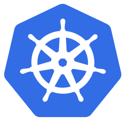

# Kubernetes

<!-- .slide: class="page-title" -->

## Kubernetes (Utilisateur)

## Sommaire (1/2)

<!-- .slide: id="master-toc" class="toc" -->

- [Contexte](#/1)
- [Premiers pas](#/2)
- [Pods](#/3)
- [Replicasets](#/4)
- [Services](#/5)
- [Volumes](#/6)

## Sommaire (2/2)

<!-- .slide: id="master-toc" class="toc" -->

- [Configuration et secrets](#/7)
- [Stratégies de déploiement](#/8)
- [Statefulsets](#/9)
- [Architecture et composants](#/10)
- [Fonctionnalités nécessaires en entreprise](#/11)
- [Développement d'applications compatibles](#/12)

## Logistique

- Horaires
- Déjeuner & pauses
- Autres questions ?

<!-- .slide: class="page-questions" -->
