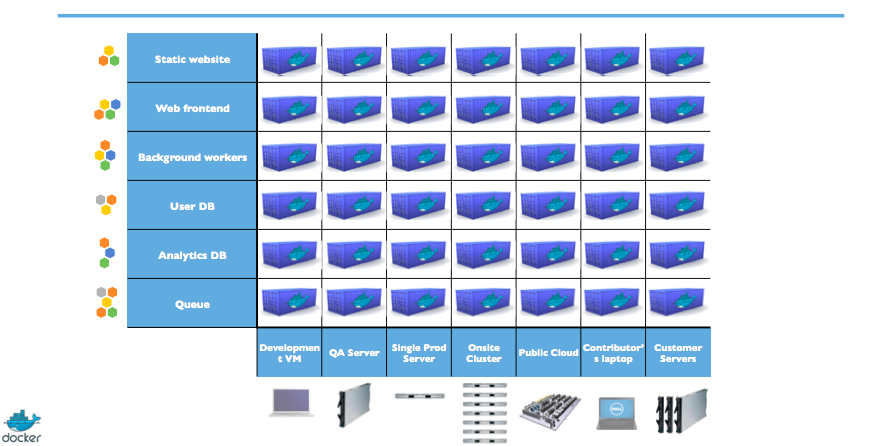
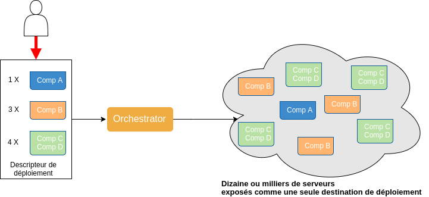

# Contexte

<!-- .slide: class="page-title" -->

## Agenda de ce chapitre 'Contexte'

<!-- .slide: class="toc" -->

- [Rappels sur les containers](#/containers-reminder)
- [Containers sans orchestration](#/containers-no-orchestration)
- [Fonctionnalités d'orchestration](#/orchestration-capabilities)
- [Orchestrateurs du marché](#/orchestrators-list)
- [Kubernetes](#/kubernetes-intro)
- [Distributions Kubernetes](#/kubernetes-distributions)
- [Versions et API](#/kubernetes-versions-and-api)

## Rappels sur les containers

<!-- .slide: id="containers-reminder" -->

- Que vous soyez Ops ou Dev ...
- Quel que soit le nombre de composants que vous développez / déployez ...
- Un des problèmes auxquels vous aurez à faire face ...
- C'est la reproductibilité des environnements

## Pourquoi est-ce si compliqué ?

- Diversité des applications à gérer
- Nombre d'applications à gérer
- Diversité des environnements (prod, pre-prod, QA, intégration, ...)
- Contraintes de mise à jour des environnements

## Contraintes Ops

- Plusieurs applications différentes sur le même host
- Plusieurs versions des serveurs d'application / runtime
- Plusieurs versions des librairies partagées
- Plusieurs versions des systèmes d'exploitations

## Contraintes Dev

- Pouvoir utiliser/tester rapidement un serveur d'application / runtime
- Pouvoir utiliser les dépendances des composants développés en local (ou au plus près du local)
- Pouvoir reproduire les environnements de production (et tous les autres !)
- Tendance à la multiplication du nombre de composants

## L'approche containers / docker

## Docker, comment ça marche

Utilisation du noyau de l'OS 'host' pour avoir plusieurs sous-systèmes isolés :

- Process
- Mémoire
- Réseau
- Stockage
- Périphériques

 
 Chaque sous-sytème est appelé un container

## Rappel : images (vs containers)

Une image :

- Modèle read-only utilisé pour démarrer des containers
- Construite par vous ou par d'autres
- Stockée sur votre host, ou le Hub docker ou votre registry privée
- Inerte / Immutable

## Rappel : (images vs) containers

Un container :

- Est construit à partir d'une image
- Contient tout ce dont votre application a besoin pour tourner
- Possède un cycle de vie (create/start/stop/restart)

## Où utiliser les containers / docker

- Sur le poste du développeur
- Sur le poste du testeur
- Sur les environnements d'intégration / recette
- En prod

 
<i class="fa fa-star" aria-hidden="true"></i> Situation idéale : _PARTOUT_ (Continuous Delivery FTW !)

## Containers sans orchestration

<!-- .slide: id="containers-no-orchestration" -->

Comment démarrer les containers ?

- en s'appuyant sur la ligne de commande `docker` ?
- en s'appuyant sur des scripts (shell) ?
- en s'appuyant sur __\[insérer ici votre outil de gestion de la configuration préféré\]__ (Ansible, SaltStack, Chef, Puppet, ...)

## Comment choisir sur quels hosts doivent tourner vos containers

Le mode __Pet__ (animal de compagnie) :

- chaque serveur/host est paramétré pour recevoir un ensemble connu à l'avance d'applications
- chaque serveur possède des caractéristiques correspondant aux applications qu'il héberge
- chaque serveur est taillé pour recevoir un ensemble d'applications et contenir les pics de charge

Notes :

Le mode à l'ancienne où chaque serveur est un animal choyé et connu VERSUS du bétail...

## Comment exposer vos services containerisés

- Host port binding : à vous de maintenir la liste des ports utilisés
- auto-mapping (`docker run -P nginx`) : à vous de trouver comment récupérer les ports choisis par Docker

 
<i class="fa fa-arrow-right" aria-hidden="true"></i> utiliser des mécanismes de __service discovery__ (Consul, Etcd, Zookeeper, ...)

## Comment ...

- Comment gérer les containers arrêtés suite à une erreur ?
- Comment gérer les pannes des hosts ?
- Comment gérer la maintenance de vos hosts ?
- Comment gérer les mises à l'échelle (scale up/down) ?
- Comment gérer la multiplication du nombre de composants à déployer ?
- Comment gérer les mises à jour de vos composants ?

## Comment partager vos process de déploiement

 
 
 
<i class="fa fa-users" aria-hidden="true"></i> Comment faire pour que les développeurs/testeurs/opérateurs puissent être autonomes ?

Notes :

Et avoir le même process de déploiement quel que soit l'environnement

## There's not such thing as freelunch!

## Une solution : l'utilisation d'un orchestrateur

<!-- .slide: id="orchestration-capabilities" -->

- Les orchestrateurs répondent à toutes les problématiques citées précédemment
- Les orchestrateurs sont souvent présentés comme des systèmes d'exploitation des datacenters
- Ce sont des outils facilitant la gestion/le pilotage du cycle de vie de vos composants containerisés

## L'orchestration vue par l'utilisateur

## Placement et gestion du cycle de vie des containers

<i class="fa fa-table" aria-hidden="true"></i> l'orchestrateur choisit où faire tourner vos composants en fonction des contraintes que vous positionnez :

- contrainte technique : réseau, type de matériel (SSD/HDD), ...
- contrainte de co-localisation
- nombre de replicas
- disponibilités des ressources CPU / mémoire / stockage

##  Gestion du Failover

- L'orchestrateur s'occupe de redémarrer les composants stoppés anormalement
- que ce soit des containers
- ou des noeuds / hosts
- L'orchestrateur propose aussi des fonctionnalités de haute-disponibilité des noeuds de management

Notes :

Si plusieurs DC on peut faire de la fédération de cluster (un cluster kube par DC et fédération des clusters)

## Fonctionnalités réseau

- Load Balancing
- Mécanismes de Service Discovery
- Fourniture de solutions réseau (de type __overlay__ la plupart du temps) qui permettent à vos containers de communiquer entre eux sans avoir à passer par des ports des noeuds les hébergeant

Notes :

On peut ne pas utiliser l'Overlay Networks mais du matériel spécialisé (permet un meilleur contrôle du réseau mais demande du matériel)

## Fonctionnalités d'orchestration

- Gestion du Stockage distribué/persistent
- Gestion des Secrets et de Configuration distribuée
- Mise à l'échelle manuelle / automatique
- Fourniture d'une ligne de commande (CLI) et d'une api REST facilitant l'automatisation
- Descripteurs de déploiement sous forme de code
- __Role Based Access Control__ : gestion des droits d'accès aux ressources mises à disposition

Notes :

Qui dit descripteur au format fichier (yaml, json) dit versionning

## Des Orchestrateurs

<!-- .slide: id="orchestrators-list" -->

- Kubernetes
- Docker Swarm
- Mesos + Marathon
- Rancher
- Nomad
- Titus (Mesos + Mantis [scheduling/job mgmt] + Titan)
- Openshift V3 (Kubernetes)
- CloudFoundry **Container** Runtime (ne pas confondre avec CloudFoundry **Application** Runtime)
- K3S

Notes :

Depuis la DockerCon d'octobre 2017 (Copenhague) Kube est officiellement dans Docker Entreprise...

La distrib DC/OS de Mesos+Marathon supporte aussi Kube

Cloudfoundry Application Runtime => la version PaaS de CF, qui ne s'appuie pas sur K8S; orchestration maison, container runtime = diego/garden compatible avec les images docker
Cloudfoundry Container Runtime => Distribution kubernetes

## Kubernetes

<!-- .slide: id="kubernetes-intro" -->

## Introduction à Kubernetes

 
 
 
 
> Kubernetes est une plateforme open-source conçue pour automatiser, mettre à l'échelle et opérer des composants applicatifs containérisés

## Historique

- Google a initié le projet Kubernetes en 2014
- Kubernetes s'appuie sur 15 années d'expérience pendant lesquelles Google a fait tourner en production des applications à grande échelle :
  - [Borg](https://research.google.com/pubs/pub43438.html)
  - [Omega](https://research.google.com/pubs/pub41684.html)
- Kubernetes a été enrichi au fil du temps par les idées et pratiques mises en avant par une communauté très active

## Signification

- Le nom **Kubernetes** vient du grec, et signifie __Timonier__ ou __Pilote__
- **k8s** est une abbréviation dérivée du remplacement des **8** lettres de __“ubernete”__ par un __“8”__
- Prononciation [koo-ber-nay'-tisse](https://github.com/kubernetes/kubernetes/issues/44308#issuecomment-335401740)

<audio controls="controls" src="./ressources/2y_8980628_38_372140_1.mp3"></audio>

## Ressources

- [Le site officiel](https://kubernetes.io/) <i class="fa fa-external-link" aria-hidden="true"></i>
- [La documentation](https://kubernetes.io/docs/home/) <i class="fa fa-external-link" aria-hidden="true"></i> :
  - [Concepts](https://kubernetes.io/docs/concepts/) <i class="fa fa-external-link" aria-hidden="true"></i>
  - [Tutoriaux](https://kubernetes.io/docs/tutorials/) <i class="fa fa-external-link" aria-hidden="true"></i>
  - [Tâches communes](https://kubernetes.io/docs/tasks/) <i class="fa fa-external-link" aria-hidden="true"></i>
  - [API et kubectl](https://kubernetes.io/docs/reference/) <i class="fa fa-external-link" aria-hidden="true"></i>
- [Le code source](https://github.com/kubernetes/kubernetes) <i class="fa fa-external-link" aria-hidden="true"></i>
- [Le compte twitter](https://twitter.com/kubernetesio) <i class="fa fa-external-link" aria-hidden="true"></i>
- [Le canal Slack](http://slack.k8s.io/) <i class="fa fa-external-link" aria-hidden="true"></i>
- [La section StackOverflow](http://stackoverflow.com/questions/tagged/kubernetes) <i class="fa fa-external-link" aria-hidden="true"></i>

Notes :

- Concepts : explications de comment fonctionne k8s
- Tutoriaux : instructions détaillées sur comment l'utiliser
- Tasks : instructions détaillées pas à pas des taches les plus communes : gestion des logs, autoscaling, applis stateful
- API et `kubectl` : très utile quand on cherche les options détaillées dans la config yaml

## Distributions (1/2)

- [kubeadm](https://github.com/kubernetes/kubeadm) et [minikube](https://github.com/kubernetes/minikube)
- [Docker EE, Docker4mac, Docker4win](https://blog.docker.com/2017/10/kubernetes-docker-platform-and-moby-project/)
- Apprenda [Kismatic Enterprise Toolkit](https://apprenda.com/kismatic/), CoreOS/RedHat [Tectonic](https://coreos.com/tectonic/), [GiantSwarm](https://giantswarm.io/)
- [GKE](https://cloud.google.com/kubernetes-engine/), [AKS](https://docs.microsoft.com/en-us/azure/aks/), [EKS](https://aws.amazon.com/eks/)
- [Rancher 1.x](http://rancher.com/docs/rancher/v1.6/en/kubernetes/) (orchestration engine option) and [Rancher 2.x](http://rancher.com/docs/rancher/v2.0/en/quick-start-guide/) (native), RKE [Rancher Kubernetes Engine](https://github.com/rancher/rke)
- RedHat OpenShift v3 ([Origin](https://docs.openshift.org/latest/welcome/index.html) et [Container Platform](https://www.openshift.com/container-platform/))

Notes :

- Kubeadm : très bien mais ne gère pas (encore) la haute disponibilité
- GKE & AKS & EKS : gestion des master géré par Google, Azure, Amazone (EKS)
- Rancher 1 : leur propre orchestrateur, Rancher 2 : Kube (avec leurs surcouches)
- Docker4mac, Docker4win : Doivent inclure kube en natif...
- Kismatic : AWS, GCE, Azure, Rackspace, Packet (s'appui sur terraform)
- Tectonic : AWS, Azure, Bare Metal (s'appuie sur Terraform). Licence "gratuite" pour 10 noeuds
- Openshift s'appuie sur Ansible

## Distributions (2/2)

- [PKS /Pivotal Container Service](https://pivotal.io/platform/pivotal-container-service) / [Cloudfoundry Container Runtime (ex Kubo)](https://www.cloudfoundry.org/container-runtime/)
- [kops](https://github.com/kubernetes/kops) (Kubernetes Operations) and [kubicorn](http://kubicorn.io/)
- Playbooks ([kubespray](https://github.com/kubernetes-incubator/kubespray) et [kubernetes/contrib](https://github.com/kubernetes/contrib/tree/master/ansible)) et [modules](http://docs.ansible.com/ansible/latest/kubernetes_module.html) Ansible, [templates](https://www.ecosia.org/search?tt=vivaldi&q=kubernetes%20terraform) et [providers](https://www.terraform.io/docs/providers/kubernetes/index.html) Terraform
- [Kubernetes Distributions and Platforms](https://docs.google.com/spreadsheets/d/1LxSqBzjOxfGx3cmtZ4EbB_BGCxT_wlxW_xgHVVa23es/edit#gid=0)

Notes :

- kops : AWS, Google Compute Engine (alpha), VMWare (alpha), d'autres plateformes planifiées
- kubicorn : AWS, Azure, DigitalOcean, Google Cloud
- kubespray : AWS, GCE, Azure, OpenStack, vSphere or Baremetal, vagrant, peut-être le plus complet en OSS
- Ansible : modules dédiés depuis la version 2.1
- Minikube : win (virtualbox, hyper-v), mac (hyperkit, xhyve, virtualbox, vmware fusion), linux (virtualbox, kvm)
- MicroK8s : `Kubernetes in a snap that you can run locally.` Une alternative à minikube pour Linux
- K3S : Un kube certifié, alléger, épuré et sans HA (enlève des API obsolètes, un seul binaire, remplace etcd par SQLite, Docker par runc)

## Kubernetes the hard way

[https://github.com/kelseyhightower/kubernetes-the-hard-way](https://github.com/kelseyhightower/kubernetes-the-hard-way) par [Kelsey Hightower](https://twitter.com/kelseyhightower)

- Tutoriel d'installation __manuelle__ de Kubernetes
- Optimisé pour l'apprentissage :
  - choix de passer par une installation longue et détaillée pour bien comprendre chacune des étapes nécessaires à la création d'un cluster Kubernetes

Notes :

Kelsey Hightower : ex de CoreOS, maintenant chez Google

## Kubernetes et docker

- K8S <= 1.11 : Les versions 1.11.2, 1.12.6, 1.13.1, et 17.03.2 sont testées et validées lors des tests d'intégration continue
- K8S >= 1.12 : 1.11.1, 1.12.1, 1.13.1, 17.03, 17.06, 17.09, 18.06

Notes :

- Vrai pour k8s 1.8, 1.9, 1.10 (voir la section "external dependencies" dans la release note)
- La version 1.9 apporte des changements dans l'API, notamment apiVersion : apps/v1beta2 => apps/v1. Si l'on utilise un minikube récent et avec un cluster k8s en v1.8 certain pods ne fonctionneront pas, notamment celui du dashboard [see](https://kubernetes.io/docs/reference/workloads-18-19/)

## Kubernetes sans docker

Il est possible d'utiliser d'autres solutions de containérisation en lieu et place de Docker :

- `rkt` de [CoreOS](https://github.com/coreos/rkt) ([Running Kubernetes with rkt](https://kubernetes.io/docs/getting-started-guides/rkt/) <i class="fa fa-external-link" aria-hidden="true"></i>)
- `CRI-O` est un [projet en incubation](https://github.com/kubernetes-incubator/cri-o) qui s'appuie sur la [Container Runtime Interface](https://github.com/kubernetes/community/blob/master/contributors/devel/container-runtime-interface.md) de l'[Open Container Initiative](https://www.opencontainers.org/) ([Six reasons why cri-o is the best runtime for k8s](https://www.projectatomic.io/blog/2017/06/6-reasons-why-cri-o-is-the-best-runtime-for-kubernetes/)<i class="fa fa-external-link" aria-hidden="true"></i>)

## Versions de Kubernetes

<!-- .slide: id="kubernetes-versions-and-api" -->

- [v1.14.0](https://github.com/kubernetes/kubernetes/blob/master/CHANGELOG-1.14.md) le 25/03/19
- [v1.13.0](https://github.com/kubernetes/kubernetes/blob/master/CHANGELOG-1.13.md) le 03/12/18
- [v1.12.0](https://github.com/kubernetes/kubernetes/blob/master/CHANGELOG-1.12.md) le 28/09/18
- [v1.11.0](https://github.com/kubernetes/kubernetes/blob/master/CHANGELOG-1.11.md) le 27/06/18
- [v1.10.0](https://github.com/kubernetes/kubernetes/blob/master/CHANGELOG-1.10.md) le 26/03/18
- [v1.9.0](https://github.com/kubernetes/kubernetes/blob/master/CHANGELOG-1.9.md) le 18/01/18
- ...
- v1.0.0 le 13/07/15

 

- [Tous les Changelogs](https://github.com/kubernetes/kubernetes/blob/master/CHANGELOG.md)
- [Toutes les Releases](https://github.com/kubernetes/kubernetes/releases)

## Version de Kubernetes utilisée pour la formation

La formation est écrite par rapport à la version *v1.9*.

<!-- .slide: class="page-questions" -->
