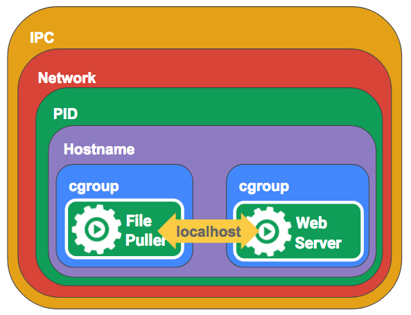
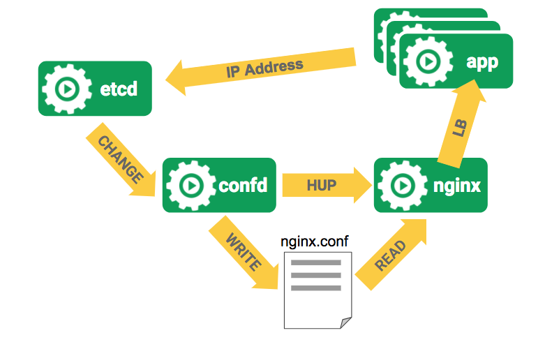
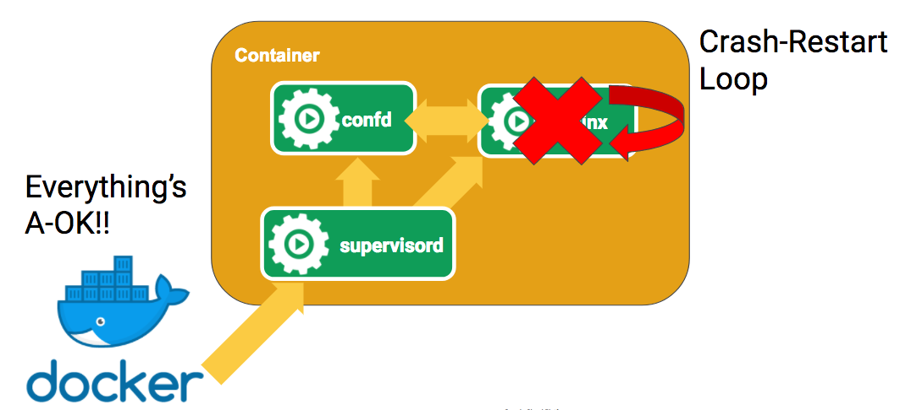
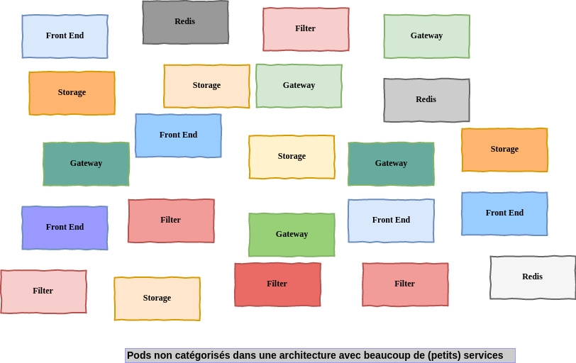
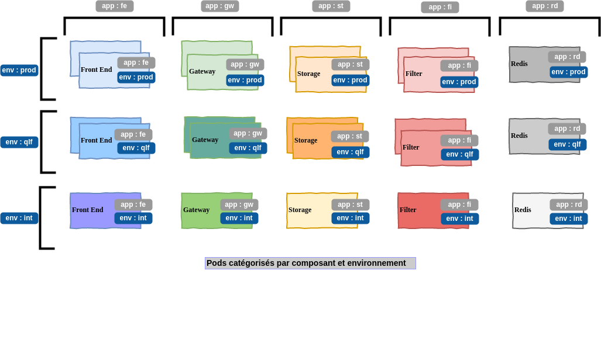

# Pods

<!-- .slide: class="page-title" -->


## Agenda de ce chapitre 'Pods'

<!-- .slide: class="toc" -->

- [Modèle/Concept du pod](#/pod-concept)
- [Descripteurs yaml et json](#/pod-descriptors)
- [Organisation des pods avec les labels, les sélecteurs et les namespaces](#/labels-selector-and-namespaces)
- [Cycle de vie des pods](#/pods-lifecycle)
- [InitContainers](#/init-containers)


## Modèle/Concept du pod

<!-- .slide: id="pod-concept" -->

- Un __pod__ (une cosse, une gousse, une coque) est un groupe d'un ou plusieurs containers (Docker par ex)
- Le pod est la brique de base d'un déploiement k8s
- C'est la brique de déploiement la plus petite que l'on puisse créer / déployer

<br/>
Le concept du Pod permet à des containers de partager des ressources afin de pouvoir collaborer plus facilement.


## Partage du namespace de PIDs

- Les containers d'un même _Pod_ peuvent potentiellement partager le même espace de PIDs
- Le partage du namespace de __PID__ est activable/désactivable sous conditions :
  - compatible docker >= __1.13.1__ et Kubernetes >= __1.7__
  - activé par défaut dans Kubernetes 1.7 mais désactivable (option du composant `kubelet` `--docker-disable-shared-pid=false` par défaut)
  - désactivé par défaut dans Kubernetes >= 1.8 mais activable (option du composant `kubelet` `--docker-disable-shared-pid=true` par défaut)
  - Kubernetes >= 1.10 : `pods.spec.PodShareProcessNamespace` en `alpha`
  - Kubernetes >= 1.12 : `pods.spec.PodShareProcessNamespace` en `beta`


## Partage des autres types de ressources

- Les containers au sein d'un pod partagent le même IPC et peuvent donc communiquer en utilisant les sémaphores __SystemV__ ou la mémoire partagée __POSIX__
- Les containers au sein d'un pod partagent la même adresse IP, le même espace de ports et peuvent se 'trouver' par le biais de `localhost`
- Les containers au sein d'un pod peuvent accéder aux mêmes volumes
- Les containers d'un pod sont __toujours__ co-localisés et co-gérés


## Pod multi-container partageant les mêmes ressources

<figure>
    
</figure>


## Pod multi-container partageant un même volume

<figure>
    
</figure>


## Différence entre Docker et les Pods Kubernetes

<figure>
    
</figure>

- Imaginons qu'on veuille utiliser `nginx` et `confd` pour mettre à jour la configuration lors qu'on ajoute/retire des serveurs
- Les couples (adresses IP, port) des serveurs d'application sont stockés dans `etcd`
- Quand la liste des serveurs d'application change, `confd` est notifié et écrit la nouvelle version de la configuration `nginx` puis envoie un signal `HUP` à `nginx` pour qu'il recharge sa configuration


Notes :

On a un ensemble d'applications qui vont pousser leurs configs dans etcd.

confd écoute etcd et génère un nouveau de fichier de config pour le RP nginx

Les nouvelles app sont enregistrées dans etcd => confd => modif et notif nginx


## Implémentation dans Docker

<figure>
    
</figure>

- Avec Docker, on va mettre `confd` et `nginx` dans un seul container
- Mais le process principal du container sera (par exemple) `supervisord` car Docker ne supporte qu'un process principal à surveiller
- Si quelque chose se passe mal avec `nginx`, Docker n'en aura aucune idée car le process qu'il supervise c'est `supervisord`


## Implémentation avec Kubernetes

<figure>
    
</figure>

- Grace au modèle des pods, Kubernetes supervise chacun des process et connaît donc les états de chacun d'entre eux
- De cette manière, il est possible de redémarrer individuellement les process/containers si besoin (ou d'en voir les logs !)


## Comment choisir entre plusieurs pods ou plusieurs containers dans un pod ?

Se poser les questions :

- Les containers doivent-ils tourner au même endroit ou peuvent-ils être répartis sur plusieurs noeuds ?
- Les containers représentent-ils un seul tout ou sont-ils des composants indépendants ?
- Les containers peuvent-ils/doivent-ils être mis à l'échelle ensemble individuellement ?

<br/>
La plupart du temps, vous devriez séparer vos containers dans des pods distincts à moins qu'il n'y ait une raison particulière de ne pas le faire !


Notes :

Question à se poser : est ce que je dois mettre plusieurs containers dans un POD ?


## Cas d'usage de plusieurs containers dans un pod

- Recharger de la configuration à chaud sur déclenchement d'évènement
- Service routing
- Télémétrie

<br/>
Le gros avantage est de ne pas avoir à modifier l'application principale
<br/>
<br/>
Dans ce cadre d'utilisation, les containers associés au container principal sont parfois appelés `sidecar containers` ou `sidekick containers`


Notes :

Service routing est une fonctionnalité offerte par les service mesh tel que ISTIO (mais un service mesh couvre un périmètre plus vaste)


## Descripteurs yaml et json

<!-- .slide: id="pod-descriptors" -->

- Au lieu d'utiliser `kubectl run xxx --generator=run-pod/v1` ...
- il est possible de s'appuyer sur des descripteurs au format `yaml` ou `json`


## Exemple de descripteur au format json

```json
{
  "kind": "Pod",
  "apiVersion": "v1",
  "metadata": {
      "name": "whoami",
      "labels": {
          "app": "whoami"
      }
  },
  "spec": {
      "containers": [
          {
              "name": "whoami",
              "image": "containous/whoami:latest",
              "ports": [ { "containerPort": 80 } ],
          }
      ],
      "restartPolicy": "Always"
  }
}
```


## Exemple de descripteur au format yaml

```yaml
---
apiVersion: v1
kind: Pod
metadata:
  name: whoami
  labels:
    app: whoami
spec:
  containers:
    - name: whoami
      image: containous/whoami:latest
      imagePullPolicy: Always
      ports:
      - containerPort: 80
  restartPolicy: Always
```


## Rappel : obtenir un template de descripteur

`kubectl run whoami --image=containous/whoami:latest --port=80 --generator=run-pod/v1 --dry-run -o yaml`


Notes :

Utile pour le TP qui va suivre


## Utiliser 'kubectl explain' pour accéder à la documentation des ressources

```shell
└> kubectl explain pods

DESCRIPTION:
Pod is a collection of containers that can run on a host. This resource is created by clients and scheduled onto hosts.

FIELDS:
   metadata	<Object>
     Standard object's metadata. More info:
     https://git.k8s.io/community/contributors/devel/api-conventions.md#metadata

   spec	<Object>
     Specification of the desired behavior of the pod. More info: https://
     git.k8s.io/community/contributors/devel/api-conventions.md#spec-and-status/

   status	<Object>
     Most recently observed status of the pod. This data may not be up to date.
     Populated by the system. Read-only. More info: https://git.k8s.io/community/
     contributors/devel/api-conventions.md#spec-and-status/

   apiVersion	<string>
     APIVersion defines the versioned schema of this representation of an
     object. Servers should convert recognized schemas to the latest internal
     value, and may reject unrecognized values. More info:
     https://git.k8s.io/community/contributors/devel/api-conventions.md#resources

   kind	<string>
     Kind is a string value representing the REST resource this object
     represents. Servers may infer this from the endpoint the client submits
     requests to. Cannot be updated. In CamelCase. More info:
     https://git.k8s.io/community/contributors/devel/api-conventions.md#types-kinds
```


Notes :

Oui, tout n'est pas visible à l'écran, mais c'est pas important :D


## Utiliser les paths json pour aller plus loin

```shell
└> kubectl explain pods.spec.containers

RESOURCE: containers <[]Object>

DESCRIPTION:
     List of containers belonging to the pod. Containers cannot currently be
     added or removed. There must be at least one container in a Pod. Cannot be
     updated.

    A single application container that you want to run within a pod.

FIELDS:
   workingDir	<string>
     Container's working directory. If not specified, the container runtime's
     default will be used, which might be configured in the container image.
     Cannot be updated.

   command	<[]string>
     Entrypoint array. Not executed within a shell. The docker image's
     ENTRYPOINT is used if this is not provided. Variable references $(VAR_NAME)
     are expanded using the container's environment. If a variable cannot be
     resolved, the reference in the input string will be unchanged. The
     $(VAR_NAME) syntax can be escaped with a double $$, ie: $$(VAR_NAME).
     Escaped references will never be expanded, regardless of whether the
     variable exists or not. Cannot be updated. More info: https://kubernetes.io/
     docs/tasks/inject-data-application/define-command-argument-container/
     #running-a-command-in-a-shell/

   env	<[]Object>
     List of environment variables to set in the container. Cannot be updated.

   imagePullPolicy	<string>
     Image pull policy. One of Always, Never, IfNotPresent. Defaults to Always
     if :latest tag is specified, or IfNotPresent otherwise. Cannot be updated.
     More info:
     https://kubernetes.io/docs/concepts/containers/images#updating-images

   livenessProbe	<Object>
     Periodic probe of container liveness. Container will be restarted if the
     probe fails. Cannot be updated. More info: https://kubernetes.io/docs/
     concepts/workloads/pods/pod-lifecycle#container-probes/
```


Notes :

Oui, tout n'est pas visible à l'écran, mais c'est pas important :D


## Contraintes sur certaines valeurs dans les descripteurs

```shell
└> kubectl explain pods.spec.containers
...
FIELDS:
...
   imagePullPolicy	<string>
     Image pull policy. One of Always, Never, IfNotPresent. Defaults to Always
     if :latest tag is specified, or IfNotPresent otherwise. Cannot be updated.
     More info:
     https://kubernetes.io/docs/concepts/containers/images#updating-images

   name	<string> -required-
     Name of the container specified as a DNS_LABEL. Each container in a pod
     must have a unique name (DNS_LABEL). Cannot be updated.
...
```


Notes :


## DNS_LABEL

La contrainte `specified as a DNS_LABEL` fait référence à la [rfc1123](https://www.ietf.org/rfc/rfc1123.txt)

> a DNS-1123 label must consist of lower case alphanumeric characters or '-', and must start and end with an alphanumeric character (e.g. 'my-name',  or '123-abc', regex used for validation is '[a-z0-9]([-a-z0-9]*[a-z0-9])?')

<br/>
__Attention__ : Kubernetes impose d'utiliser des valeurs `lower case` (voir la [PR 39675](https://github.com/kubernetes/kubernetes/pull/39675))


## imagePullPolicy

- `imagePullPolicy` permet de spécifier à k8s sa politique pour aller chercher les images
- Elle vaut par défaut :
  - `Always` si le tag de l'image docker est `latest`
  - `IfNotPresent` si tag pas `latest`

Ex :

- `image : nginx` => imagePullPolicy par défaut = "Always"
- `image : mon-service-springboot:1.2.1-SNAPSHOT` => imagePullPolicy par défaut = "IfNotPresent"

<i class="fa fa-arrow-right" aria-hidden="true"></i> Il est fortement conseillé d'être explicite et de toujours spécifier la valeur du `imagePullPolicy`

Notes :

- rappel : "latest" c'est pas la dernière image poussée, mais le tag par défaut
- Attention : si tag = version SNAPSHOT maven,


## Créer un pod à partir d'un fichier de description

Pour créer un pod de manière __impérative__ (vrai pour les autres types de ressources), utiliser la commande `kubectl create`

```shell
└> kubectl create -f pod-from-file.yml
pod "k8s-rulez" created

└> kubectl get po k8s-rulez
NAME        READY     STATUS    RESTARTS   AGE
k8s-rulez   1/1       Running   0          11s
```


## Plusieurs ressources dans un seul fichier (1/2)

Il est tout à fait possible de décrire plusieurs ressources (de type différent ou pas) dans un unique fichier

```yaml
---
apiVersion: v1
kind: Pod
metadata:
  name: first-of-two
spec:
  containers:
    - image: nginx:alpine
...
---
apiVersion: v1
kind: Pod
metadata:
  name: second-of-two
spec:
  containers:
    - image: redis:alpine
...
```


## Plusieurs ressources dans un seul fichier (2/2)

<br/>

```shell
└> kubectl create -f two-pods-in-one-file.yml
pod "first-of-two" created
pod "second-of-two" created
```


Notes :

On peut indiquer un répertoire (à la place d'un fichier) au -f, voir de lui demander de faire du récursif.


## Mise à jour d'une ressource existante

- Il est possible de mettre à jour certains paramètres d'une ressource existante
- Les paramètres qui ne peuvent pas être mis à jour sont indiqués dans la documentation (`kubectl explain pods.spec.containers` par exemple)
- Pour mettre à jour une ressource : `kubectl apply -f <descripteur>.yml|json`


## 'kubectl create --save-config'

- Lorsque vous mettez à jour la configuration d'une ressource, vous pouvez recevoir le message suivant :

> Warning: kubectl apply should be used on resource created by either kubectl create --save-config or kubectl apply

- Ce message apparaît car lors de la création sans l'option `--save-config` l'annotation `kubectl.kubernetes.io/last-applied-configuration` attendue par `kubectl apply` n'est pas créée
- 2 options :
  - Utiliser `kubectl create -f <descripteur>.yml|json --save-config`
  - Utiliser `kubectl apply -f <descripteur>.yml|json` même pour créer une nouvelle ressource


## TP 2.1 : Création de pods avec descripteurs

<!-- .slide: class="page-tp2" -->


## Anatomie d'un fichier descripteur

```yaml
---
apiVersion: v1
kind: Pod
metadata:
  labels:
    label.nodevops.io/we-are: cool
  name: k8s-rulez
spec:
  containers:
    - name: shelly
      image: centos:7
      command:
        - bash
        - -c
        - sleep infinity
(...)
status:
  phase: Running
  podIP: 172.17.0.10
  startTime: 2017-10-09T12:42:42Z
  conditions:
    - lastProbeTime: null
      lastTransitionTime: 2017-10-09T12:42:42Z
      status: "True"
      type: Initialized
```


## Anatomie d'un fichier descripteur (suite)

- Le descripteur (`yaml` dans notre cas) peut se décomposer en plusieurs sous-parties :
  - `apiVersion`
  - `kind`
  - `metadata`
  - `spec`
  - `status`
- Ces sous-parties se retrouvent dans tous les types de ressource
- Certaines informations sont en mode `readonly` uniquement (notamment tout ce qui se trouve dans `status`)


## Organisation des pods avec les labels, les sélecteurs et les namespaces

<!-- .slide: id="labels-selector-and-namespaces" -->

- Pour l'instant, notre instance Kubernetes ne contient que quelques pods
- Mais dans la *vraie vie*, le nombre de pods va se multiplier :
  - plusieurs versions d'un même composant peuvent cohabiter (sur des environnements différents, ou pas)
  - chaque composant peut potentiellement être répliqué
- Comment s'y retrouver (que l'on soit dev ou ops) ?


## Besoin de ranger ?




Notes :

- les différentes couleurs représentent des environnements différents et/ou des versions différentes


## Organiser avec des labels

- Les __labels__ peuvent être utilisés pour organiser et sélectionner des sous-ensembles d'objets
- Le but des __labels__ est de pouvoir positionner des attributs sur les objets Kubernetes
- Ces attributs sont utiles pour les utilisateurs de __k8s__ mais n'ont pas de valeur pour __k8s__ lui-même
- Les __labels__ peuvent être attachés aux objets lors de leur création ou être ajoutés/supprimés par la suite
- Chaque objet peut avoir un ensemble de __labels__ sous la forme __clé/valeur__
- Chaque clé doit être unique pour un objet donné


## Exemple d'organisation avec des labels




## Syntaxe et caractères autorisés pour les labels

- Les __Labels__ sont des couples clé/valeur
- Clé valide : 2 sous-parties, 1 préfixe optionnel et un nom, séparés par un slash (`/`)
  - Le nom est obligatoire et doit contenir moins de 63 caractères, commencer et finir par un alphanumérique et peut contenir des tirets (`-`), des underscores (`_`), des points (`.`), et d'autres alphanumériques
  - Le préfixe est optionnel
  - S'il est spécifié, le préfixe doit être sous la forme d'un domaine __DNS__ : une série de __labels DNS__, séparés par des points et dont la longueur totale ne doit pas dépasser 253 caractères
- Valeur valide : moins de 63 caractères, doit commencer et finir par un alphanumérique et peut contenir des tirets (`-`), des underscores (`_`), des points (`.`), et d'autres alphanumériques


## Syntaxe et caractères autorisés pour les labels (exemples)

| Label | Valeur | Validité
|-------|--------|----------
| my-label | zenika | OK
| nodevops.io/my-label | zenika | OK
| orchestrator | I_love_Kubernetes | OK
| /my-label | whatever | __KO__
| label-with-large-value | invalid-very-very-large-value-label-that-has-more-than-63-characters | __KO__
| value-does-not-start-with-alphanum | _anything | __KO__


## Spécifier des labels lors de la création

<br/>

```yaml
---
apiVersion: v1
kind: Pod
metadata:
  name: k8s-rulez
  labels:
    nodevops.io/my-label: zenika-rulez
    app: shell-gateway
    env: int
spec:
  containers:
    - name: shelly
      image: centos:7
      imagePullPolicy: Always
      command:
        - "bash"
        - "-c"
        - "sleep infinity"
```


## Spécifier des labels a posteriori

- Utiliser la commande `kubectl label <resourceType> <resourceName> key=value` pour ajouter des labels à une ressource existante :
  - ex : `kubectl label pod k8s-rulez release=stable` pour ajouter le label `release=stable`
- Pour surcharger une clé déjà existante, utiliser l'option `--overwrite`
  - ex : `kubectl label pod k8s-rulez release=unstable --overwrite` pour écraser la précédente valeur du label avec comme clé `release`
- Pour supprimer une clé, utiliser la syntax `key-` :
  - ex : `kubectl label pod k8s-rulez release-`


## Afficher les labels des pods

- Les labels sont visibles par le biais de la commande `kubectl describe`
- Ou en ajoutant l'option `--show-labels` à `kubectl get <resourceType> [<resourceName>]`
- L'option `-L <clé1>[,<clé2>,...]` (ou `--label-columns`) permet d'ajouter une colonne dédiée pour chaque clé spécifiée

```shell
└> kubectl get po -L app,run
NAME           READY   STATUS    RESTARTS   AGE   APP             RUN
centos-sh      1/1     Running   0          22h                   centos-sh
k8s-rulez      1/1     Running   0          1h    shell-gateway
whoami-086vd   1/1     Running   0          21h                   whoami
whoami-5c05r   1/1     Running   0          1d                    whoami
whoami-p83md   1/1     Running   1          21h                   whoami
yaml-pod       2/2     Running   0          6h                    yaml-pod

```


## Séléctionner les pods en fonction de leurs labels (1/3)

- Lister les pods pour lesquels `env` vaut exactement `int`

```shell
└> kubectl get pod -l env=int
NAME        READY     STATUS    RESTARTS   AGE
k8s-rulez   1/1       Running   0          2h
```

- Lister les pods pour lesquels `env` est différent de `int`

```shell
└> kubectl get po --selector "env!=int"
NAME           READY     STATUS    RESTARTS   AGE
centos-shell   1/1       Running   0          22h
whoami-086vd   1/1       Running   0          22h
yaml-pod       2/2       Running   0          6h

```


## Séléctionner les pods en fonction de leurs labels (2/3)

- Lister les pods pour lesquels le label avec comme clé `env` est positionné

```shell
└> kubectl get pod --selector env
NAME        READY     STATUS    RESTARTS   AGE
k8s-rulez   1/1       Running   0          2h
```

- Lister les pods pour lesquels le label avec comme clé `run` n'est pas positionné

```shell
└> kubectl get pod --selector '!run'
NAME        READY     STATUS    RESTARTS   AGE
k8s-rulez   1/1       Running   0          2h
```


## Séléctionner les pods en fonction de leurs labels (3/3)

- Lister les pods pour lesquels `run` possède les valeurs `whoami` ou `yaml-pod`

```shell
└> kubectl get pod --selector 'run in (whoami,yaml-pod)'
NAME         READY     STATUS    RESTARTS   AGE
whoami-086vd 1/1       Running   0          22h
whoami-5c05r 1/1       Running   0          1d
whoami-p83md 1/1       Running   1          22h
yaml-pod     2/2       Running   0          6h
```

- Lister les pods pour lesquels `run` ne possède pas les valeurs `whoami` ou `yaml-pod`

```shell
└> kubectl get pod --selector 'run notin (whoami,yaml-pod)'
NAME           READY     STATUS    RESTARTS   AGE
centos-shell   1/1       Running   0          23h
k8s-rulez      1/1       Running   0          2h
testdnslabel   1/1       Running   0          2h
```


## Combiner les selecteurs

- Lister les pods pour lesquels `app` vaut `shell-gateway` et `env` vaut `int`

```shell
└> kubectl get pod --selector app=shell-gateway,env=int
NAME        READY     STATUS    RESTARTS   AGE
k8s-rulez   1/1       Running   0          2h
```


## Positionner des labels sur un noeud

- Les labels sont des attributs que l'on peut positionner sur tous les types de ressources Kubernetes
- ... y compris les noeuds
- Pour lister les noeuds, utiliser la commande `kubectl get nodes`

```shell
> kubectl get nodes --show-labels
NAME       STATUS    ROLES     AGE       VERSION LABELS
minikube   Ready     <none>    2d        v1.7.5  beta.kubernetes.io/arch=amd64,
                                                 beta.kubernetes.io/os=linux,
                                                 kubernetes.io/hostname=minikube
```


## Utilisation des labels sur les noeuds

- Positionner un label sur un noeud permet de le typer
- Par exemple, on peut ajouter un label pour préciser que le noeud utilise des disques SSD, ou qu'il a accès à des ressources GPU

```shell
└> kubectl get nodes --label-columns ssd,GPU
NAME       STATUS    ROLES     AGE       VERSION   SSD       GPU
minikube   Ready     <none>    2d        v1.7.5    true      false
```


## Utiliser les labels pour contraindre le scheduling (1/2)

- Il est possible de contraindre le placement des pods sur des noeuds possèdant des labels particuliers
- Pour cela, utiliser la directive `nodeSelector` dans la section `spec` de la définition du pod


## Utiliser les labels pour contraindre le scheduling (2/2)

```yaml
---
apiVersion: v1
kind: Pod
metadata:
  name: elastic-on-ssd
  labels:
    app: search-engine
    env: prod
spec:
  nodeSelector:
    ssd: "true"
  containers:
    - image: elasticsearch:5
      name: elastic
```


## TP 2.2 : labels

<!-- .slide: class="page-tp2" -->


## Annotations (1/2)

- En plus des labels, il est possible d'attacher des __annotations__ aux objets Kubernetes
- A la différence des labels, les __annotations__ ne sont pas faites pour identifier les objets, i.e. il n'est pas possible d'effectuer des sélections par rapport à celles-ci
- Par contre, les annotations peuvent contenir des informations dont la taille est plus grande que celles des valeurs de label (rappel : 63 caractères) et des caractères interdits dans les valeurs de label


## Annotations (2/2)

- Les annotations ne sont visibles par le biais de la commande `kubectl get` qu'en utilisant l'option `--output=yaml|json`
- Les annotations sont aussi visibles en passant commande `kubectl describe` (mais leur valeur peut être tronquée si elle est trop grande, ce qui n'est pas le cas en passant par `kubectl get po <podName> --output=yaml|json`)


## Ajouter une annotation

- Il est possible d'ajouter une annotation à une ressource existante en passant par la commande `kubectl annotate`

```shell
└> kubectl annotate pod light-sleeper k8s.zenika.com/created-by=cfurmaniak
pod "light-sleeper" annotated
```

```shell
└> kubectl describe pod light-sleeper | grep Annotations
Annotations:  k8s.zenika.com/created-by=cfurmaniak
```


## Exemples d'informations que l'on peut stocker dans les annotations

- Numéro de build dans l'outil de CI/CD, date et IDs de release, release IDs, git branch, numéro de Pull|Merge Request numbers, hash des images utilisées, adresse de registries privées
- Liste des dépendances (services)
- Pointeurs vers les outils de centralisation des logs et des métriques, des outils de monitoring ou d'audit
- Source (qui a généré le descripteur par exemple, et quand)
- Equipes responsables de l'application, adresses de contacts (tel, mel, channels slack, ...)


## Namespaces

- Kubernetes supporte plusieurs clusters virtuels hébergés sur le même cluster physique.
- Ces clusters virtuels sont appelés `namespaces`
- Les `namespaces` permettent de séparer les objets en groupes disjoints (ce que ne peut pas assurer l'utilisation des labels)
- Les `namespaces` fournissent une portée pour les noms des objets/ressources
- Les noms des ressources sont uniques au sein d'un même `namespace`
- Mais des objets portant le même nom peuvent exister dans 2 `namespaces` distincts
- Les administrateurs du cluster peuvent allouer des [quotas de ressources](https://kubernetes.io/docs/concepts/policy/resource-quotas/) par `namespace`


Notes :

Petit script sympa pour se simplifier la vie avec les namespaces : kubens

Il y a avec kubens kubectx pour faire la même chose avec le contexte

https://github.com/ahmetb/kubectx


## Lister les namespaces

- Pour lister les namespaces existants, utiliser `kubectl get namespace` (ou `kubectl get ns`)

<br/>

```shell
└> kubectl get ns
NAME          STATUS    AGE
default       Active    2d
kube-public   Active    2d
kube-system   Active    2d
```


## Spécifier un namespace

- Quand aucun namespace n'est spécifié, c'est le namespace `default` qui est utilisé (il est possible de modifier le namespace par défaut)
- Pour spécifier le namespace dans lequel un objet doit être créé ou requêté, spécifier l'option `--namespace=<namespace>` ou `-n <namespace>`
- Pour afficher toutes les ressources, tous namespaces confondus, utiliser l'option `--all-namespaces`

<br/>

```shell
└> kubectl get po --namespace kube-system
NAME                          READY     STATUS    RESTARTS   AGE
heapster-44042                1/1       Running   0          2d
influxdb-grafana-mp6g0        2/2       Running   0          2d
kube-addon-manager-minikube   1/1       Running   0          2d
kube-dns-1326421443-h9rk4     3/3       Running   0          2d
kubernetes-dashboard-xcw0r    1/1       Running   0          2d
```


## Modifier le namespace par défaut

- `kubectl` peut se connecter à plusieurs clusters, le cluster courant est visible par la commande `kubectl config current-context`
- Le namespace par défaut est visualisable par la commande `kubectl config get-contexts <currentContextName>`
- Pour changer le namespace par défaut du contexte (cluster) en cours : `kubectl config set-context <currentContextName> --namespace=<insert-namespace-name-here>`
- ... ou passer par [kubectx et kubens](https://github.com/ahmetb/kubectx)


## Requêter les namespaces

- Lister les namespaces : `kubectl get ns`
- Voir les informations détaillées sur un namespace : `kubectl describe ns`
- Attention, les namespaces ne peuvent pas contenir de point (`.`)
- Créer un namespace : `kubectl create ns`
- Créer un namespace à partir d'un descripteur : `kubectl create -f my-ns.yml`

```yaml
---
kind: Namespace
apiVersion: v1
metadata:
  name: sandbox
  labels:
    type: sandbox
```


## Créer des objets dans un namespace

- Pour créer un objet à partir d'un descripteur vierge de tout namespace : `kubectl create|apply -f fichier.yaml -n <insert-namespace-name-here>`
- Il est possible de spécifier le namespace cible dans le descripteur directement : `kubectl create|apply -f descripteur-avec-ns.yaml`

```yaml
---
apiVersion: v1
kind: Pod
metadata:
  name: k2000
  namespace: zenika
  labels:
    app: knight-rider
    env: int
spec:
...
```


## Suppression d'un namespace

- <i class="fa fa-exclamation-triangle" aria-hidden="true"></i> Supprimer un __namespace__ supprime tous les objets associés au namespace
- ... non, il n'est pas possible de supprimer le namespace `kube-system` (ni les namespaces `default` et `kube-public`)

Notes :

C'est le NamespaceLifeCycle admission controller (https://kubernetes.io/docs/reference/access-authn-authz/admission-controllers/#namespacelifecycle) qui pilote ce comportement


## TP 2.3 : Annotations et Namespaces

<!-- .slide: class="page-tp2" -->


## Cycle de vie des pods

<!-- .slide: id="pods-lifecycle" -->

- Les pods sont mortels (i.e., ils peuvent être supprimés)
- Ils sont créés, mais ne sont pas recréés automatiquement
- (C'est le travail des __ReplicaSets__/__Replication Controllers__ que l'on verra par la suite)
- Par contre, si un des containers gérés par le pod __meurt__ il est de la responsabilité du pod de le redémarrer (en fonction de la `restartPolicy` sélectionnée pour le pod)


Notes :

restartPolicy vaut OBLIGATOIREMENT Always pour des pods créés par des Replicaset


## Visualisation des logs

- Pour visualiser les logs d'un pod, utiliser `kubectl logs`
- Pour visualiser les logs du container `whoami` dans le pod `json-pod` : `kubectl logs json-pod -c whoami`
- Utiliser `--tail=10` pour ne voir que les 10 dernières lignes
- Utiliser `-f` pour __suivre__ les logs
- Utiliser `--since=5s|2m|3h` pour ne voir que les logs plus récents que la durée passée en paramètre


## Init Containers

<!-- .slide: id="init-containers" -->

- Un pod peut être constitué de plusieurs containers hébergeant des applications
- Mais il peut aussi s'appuyer sur un ou plusieurs `Init Containers`
- Les `Init Containers` sont comme les `containers` sauf que :
  - ils ont une durée de vie limitée
  - chacun des `Init Containers` n'est lancé que si le précédent s'est terminé sans erreur
- Si un `Init Container` est en échec, k8s redémarre le pod jusqu'à ce que l'`Init Container` se termine avec le status __succès__ (sauf si la `restartPolicy` du pod vaut `Never`)


## Quand utiliser un Init Container ?

- Ils peuvent contenir des outils qu'on ne souhaite pas forcément embarquer dans le container principal du pod pour des raisons de sécurité
- Ils peuvent contenir des outils qu'on ne souhaite pas embarquer dans le container principal pour ne pas alourdir l'image (sed, awk, python, ou dig)
- Les Init Containers partagent les mêmes volumes que les Containers, on peut donc s'en servir pour générer la configuration de l'application principale en `one-shot` (avec confd par exemple)
- Ils sont lancés avant les autres containers, on peut donc s'en servir pour attendre qu'une dépendance soit prête ou que des préconditions soient remplies


## Exemple d'Init Container

```yaml
---
apiVersion: v1
kind: Pod
metadata:
  name: myapp-pod
  labels:
    app: myapp
spec:
  containers:
    - name: myapp-container
      image: busybox
      command: ['sh', '-c', 'echo The app is running! && sleep 3600']
  initContainers:
    - name: init-myservice
      image: busybox
      command: ['sh', '-c', 'until nslookup myservice; do echo waiting for myservice; sleep 2; done;']
    - name: init-mydb
      image: busybox
      command: ['sh', '-c', 'until nslookup mydb; do echo waiting for mydb; sleep 2; done;']
```


## TP 2.4 : Logs et cycle de vie, TP 2.5 Init container


<!-- .slide: class="page-tp2" -->


<!-- .slide: class="page-questions" -->
