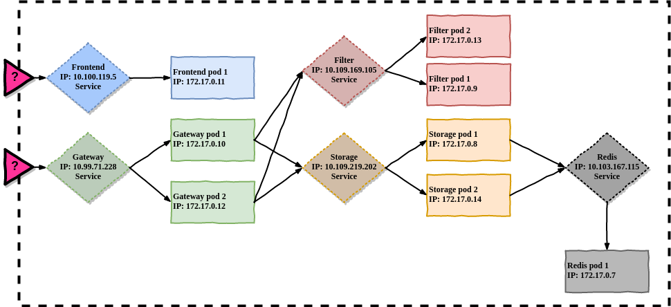
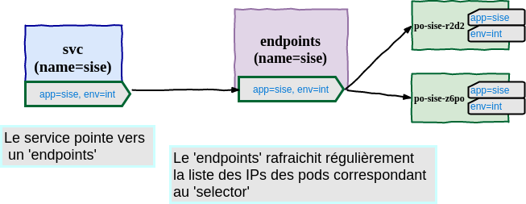
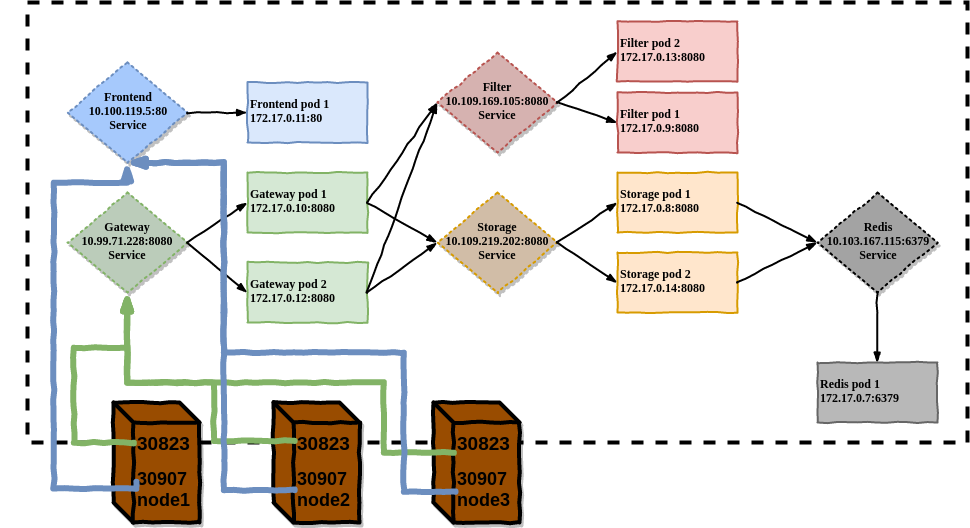
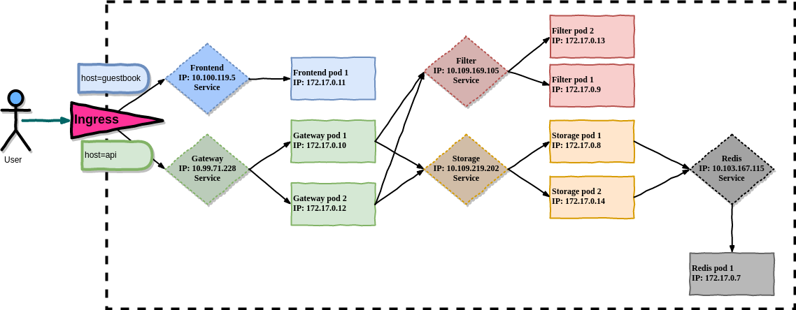

# Services

<!-- .slide: class="page-title" -->


## Agenda de ce chapitre 'Services'

<!-- .slide: class="toc" -->

- [À quoi répond le concept des services](#/why-services)
- [Exposer en interne du cluster](#/internal-services)
- [Exposer un service externe](#/external-service-links)
- [Exposer vers l'extérieur : Ingress vs LoadBalancer](#/ingress-vs-loadbalancer)
- [Sonde Readiness](#/readiness-probe)
- [Services headless](#/headless-services)


## À quoi répond le concept des services

<!-- .slide: id="why-services" -->

- Les _Pods_ sont éphémères (ils peuvent être supprimés ou déplacés)
- Kubernetes assigne une adresse IP au _Pod_ juste avant sa création, il n'est donc pas possible de la connaitre à l'avance
- La mise à l'échelle d'un _ReplicatSet_ implique que plusieurs _Pods_ hébergent la même application et fournissent donc le même service
- Les clients de ces applications ne devraient pas avoir à connaitre les IPs des différents _Pods_ qu'ils consomment
- Pour résoudre ces problématiques, Kubernetes fournit une ressource appelée __Service__ que nous allons explorer dans ce chapitre


Notes :

Le service peut être vue comme une proxy qui expose les pods


## Introduction aux Services

- Un __Service__ Kubernetes est une ressource que vous créez pour fournir un unique et constant point d'entrée pour un groupe de _Pods_ qui hébergent la même application
- Chaque _Service_ a une adresse IP (et un port associé) qui ne change pas tant que le _Service_ existe
- Les clients peuvent ouvrir des connexions vers ce couple **IP:port** et ces connexions seront redirigées vers les _Pods_ qui composent l'application
- De cette façon, les clients n'ont pas besoin de connaitre les IPs des _Pods_ qui composent l'application, ce qui permet à ces _Pods_ de pouvoir être déplacés/supprimés sans impacter les clients


Notes :

L'implémentation <= 1.8 se base sur des règles iptables configurées sur tous les noeuds du cluster (ce n'est pas un container). D'autres implémentations sont à l'étude (sur des gros cluster une modification d'un pod nécessite une maj des règles iptables sur tous les noeuds, cela peut prendre plusieurs minutes pour de très gros cluster, voir [Scale Kubernetes to Support 50,000 Services [I] - Haibin Xie & Quinton Hoole](https://www.youtube.com/watch?v=4-pawkiazEg))
Depuis la 1.9 cette implémentation basée sur IPVS est en alpha et 1.10 elle est passée en béta.


## Exemple d'utilisation des Services




## Descripteur de Service

```yaml
---
kind: Service
apiVersion: v1
metadata:
  name: whoami-int
spec:
  selector:
    app: whoami
    env: int
  ports:
  - protocol: TCP
    port: 8080
    targetPort: 80
```

<br/>

- Ce descripteur crée un service qui écoute sur le port _8080_ et va rediriger le trafic vers tous les pods qui correspondent à `app=whoami,env=int` sur le port _80_.
- Le service se verra assigner une IP interne appelée `ClusterIP`


## Exposer en interne du cluster

<!-- .slide: id="internal-services" -->

- Par défaut, si la valeur `.spec.type` d'un service n'est pas spécifiée, le type sera `ClusterIP`
- Choisir cette valeur vous permet de vous assurer que le service ne sera pas accessible depuis l'extérieur du cluster Kubernetes
<br/><br/>
<i class="fa fa-exclamation-triangle" aria-hidden="true"></i> L'ip de cluster est une IP virtuelle, il est donc impossible de la "pinguer"


Notes :

Si l'on veut faire un ping utiliser `tcping` (ping est basé sur le protocol ICMP)


## Exposer plusieurs ports pour le même service

- Les services peuvent exposer plusieurs ports (qui doivent alors être nommés)
- Par exemple, dans le cas d'une application **SpringBoot** ou **DropWizard**, vous pourriez exposer par le même service le port principal et le port d'administration

```yaml
---
apiVersion: v1
kind: Service
metadata:
  name: simple-springboot
spec:
  selector:
    app: simple-springboot
  ports:
  - name: main
    port: 80
    targetPort: 8080
  - name: admin
    port: 8000
    targetPort: 8081
```


## Nommer ses ports

- Obligatoire quand le service en expose plusieurs
- Permet d'y faire référence sans avoir à connaître la valeur du port
- Permet de pouvoir changer la valeur du port sans changer les ressources qui _consomment_ ces ports

```yaml
---
apiVersion: v1
kind: Service
metadata:
  name: simple-springboot
spec:
  selector:
    app: simple-springboot
  ports:
  - name: main
    port: 80
    targetPort: 8080
  - name: admin
    port: 8000
    targetPort: 8081
```


Notes :

- exemple de ressource consommant des ports => les ingress qu'on verra par la suite


## TP 4.1 : Premier service, TP 4.2 Exposer plusieurs ports

<!-- .slide: class="page-tp4" -->


## Service Discovery

- Devoir utiliser la `ClusterIP` pour communiquer avec le service n'est pas pratique
- Comment faire pour que les clients puissent s'en passer ?
  - Par le biais de variables d'environnement : quand un _Pod_ est démarré, Kubernetes initialise un ensemble de variables d'environnement pour chaque service qui existe au moment de la création du pod
  - Par le biais d'adresse DNS :
    - chaque service est disponible par le _fqdn_ `<nom-du-service>.<namespace>.svc.cluster.local`
    - au sein d'un même namespace, chaque service est même directement adressable simplement par son nom `<nom-du-service>`


Notes :

Pour le nom DNS `<nom-du-service>.<namespace>.svc.cluster.local` il est possible de changer `cluster.local`.

Il y a 7 variables d'env pour un service avec un port :
MYSVC_SERVICE_HOST, MYSVC_SERVICE_PORT, MYSVC_PORT, MYSVC_PORT_8080_TCP, MYSVC_PORT_8080_TCP_PROTO, MYSVC_PORT_8080_TCP_PORT, MYSVC_PORT_8080_TCP_ADDR


## TP 4.3 : Service Discovery

<!-- .slide: class="page-tp4" -->


## Dis, comment ça marche un service en fait ?

<br/>

```shell
> kubectl describe svc whoami-int
Name:              whoami-int
Namespace:         default
Labels:            app=whoami
                   env=int
Selector:          app=whoami,env=int
Type:              ClusterIP
IP:                10.0.0.72
Port:              <unset>  8080/TCP
TargetPort:        80/TCP
Endpoints:         172.17.0.8:80,172.17.0.9:80
Session Affinity:  None

```


## Endpoints



```shell
└> kubectl get endpoints whoami-int
NAME         ENDPOINTS                     AGE
whoami-int   172.17.0.8:80,172.17.0.9:80   3m
```


## Exposer un service externe

<!-- .slide: id="external-service-links" -->

- Il est possible de référencer un service externe (i.e. pas hébergé par k8s) comme un service de k8s
- i.e : Le service sera défini dans le cluster mais pointera vers un/des IPs externe/s au cluster
- Intérêt :
  - Faites pointer vos applications (hébergées dans k8s) vers le service
  - Si la/les IP/s de votre service externe change, vous avez uniquement à mettre à jour la définition du service externe
  - <i class="fa fa-thumbs-up" aria-hidden="true"></i> Vos applications ne sont pas impactées


## Service externe et endpoints

- Créer un service **sans** selecteur
- Créer la ressource _endpoints_ manuellement (avec le même nom que le service)

```yaml
apiVersion: v1
kind: Endpoints
metadata:
  name: external-service-methode1
subsets:
  - addresses:
    - ip: 11.11.11.11
    - ip: 22.22.22.22
    ports:
    - port: 80
```

- Si par la suite vous voulez héberger le service externe dans k8s, il suffit d'ajouter un selecteur sur le service (et la liste des IP/Ports sera managée par k8s)
- A l'inverse, vous pouvez supprimer un selecteur d'un service et mettre à jour manuellement la liste des IP/port


## Créer un alias pour un service externe

- Plutôt que de gérer manuellement une liste d'ip pour un service externe par le biais d'un _endpoints_
- Il est possible de (plus simplement) créer un alias en créant un service de type `ExternalName`

```yaml
---
apiVersion: v1
kind: Service
metadata:
  name: external-service
spec:
  type: ExternalName
  externalName: someapi.somecompany.com
  ports:
  - port: 80
```

- Une fois créé, le service externe est joignable depuis les pods par `external-service.default.svc.cluster.local` ou `external-service`


## TP 4.4 : Service Externe

<!-- .slide: class="page-tp4" -->


## Securiser les services au sein du cluster

- Par défaut, tout les _Pods_ acceptent du trafic de toutes les origines.
- Il serait utile de restreindre l'accès depuis/vers certains _Pods_
- Pour faire ça, on peut utiliser une _NetworkPolicy_
  - Les pods seront isolés dès qu'ils correspondent au podSelector d'une _NetworkPolicy_
  - L'administrateur du cluster doit avoir installé un plugin réseau qui supporte les _NetworkPolicy_

<br />
Deux types de policy peuvent être définies :

- `egress`: trafic qui *vient* des _Pods_ sélectionnés.
- `ingress`: trafic qui *va* vers les _Pods_ sélectionnés.


Notes :

Selon les CNI les `NetworkPolicy` seront ou ne seront pas disponibles (Calico oui, Flannel non, ...)


## Exemple de NetworkPolicy

<!-- commentaire vide pour afficher correctement le code ci-dessous (pb revealjs) -->
```yaml
kind: NetworkPolicy
apiVersion: networking.k8s.io/v1
metadata:
  name: api-allow
spec:
  podSelector:
    matchLabels:
      app: review
      role: api
  ingress:
  - from:
      - podSelector: 
          matchLabels:
            app: review
```

<br />
Cette policy autorise uniquement l'accès aux _Pods_ avec les labels `app=review` et `role=api`
depuis les _Pods_ avec le label `app=review`


Notes :

Explication détaillée des [NetworkPolicy](https://medium.com/@reuvenharrison/an-introduction-to-kubernetes-network-policies-for-security-people-ba92dd4c809d)


## Isoler des namespaces entre eux

<!-- commentaire vide pour afficher correctement le code ci-dessous (pb revealjs) -->
```yaml
kind: NetworkPolicy
apiVersion: networking.k8s.io/v1
metadata:
  namespace: my-project
  name: deny-from-other-namespaces
spec:
  podSelector:
    matchLabels:
  ingress:
  - from:
    - podSelector: {}
```

- Cette policy est déployée dans le _Namespace_ `my-project`
- `podSelector.matchLabels` est vide, donc elle s'applique à tous les _Pods_ du _Namespace_.
- `ingress.from.podSelector` est vide, donc elle permet du trafic depuis tous les _Pods_ du _Namespace_.


## Exposer un service à des clients externes

<!-- .slide: id="ingress-vs-loadbalancer" -->

- Pour l'instant nous n'avons parlé que de consommation de service par des pods du cluster lui-même
- Il est bien sûr possible d'exposer les services pour qu'ils soient accessibles par des clients externes au cluster


## Comment faire ?

- Passer par le mécanisme des `HostPort` (<i class="fa fa-exclamation-triangle" aria-hidden="true"></i> ce n'est pas un _type_ de service)
- Utiliser un service de type `NodePort`
- Utiliser un service de type `LoadBalancer`
- Créer une ressource de type `Ingress`


## Mécanisme HostPort

<br/>

```yaml
---
apiVersion: v1
kind: Pod
metadata:
  name: nginx-squat
spec:
  containers:
    - image: nginx:alpine
      name: port-squatter
      ports:
        - name: exposed
          containerPort: 80
          hostPort: 80
```

- k8s va réserver le `.spec.containers.ports.hostPort` sur le noeud du cluster où va tourner le pod pour le service
- Il faut donc savoir sur quel noeud tourne le pod pour pouvoir y accéder
- Réservez l'utilisation des _hostPorts_ à des cas particuliers (voir _Ingress_ plus tard)


## Service de type NodePort (1/3)

<br/>

```yaml
---
apiVersion: v1
kind: Service
metadata:
  name: whoami-nodeport
spec:
  type: NodePort
  selector:
    app: whoami
  ports:
  - port: 8080
    targetPort: 80
    nodePort: 30123
```

- k8s va réserver un port sur tous ses noeuds (le même sur tous les noeuds) et rediriger le trafic qui arrive sur ce port vers le service concerné
- À noter : une `ClusterIP` sera aussi créée pour la communication interne


## Service de type NodePort (2/3)

<br/>

```shell
└> kubectl get svc whoami-int
NAME         TYPE       CLUSTER-IP   EXTERNAL-IP   PORT(S)          AGE
whoami-int   NodePort   10.0.0.72    <none>        8080:30123/TCP   52m
```

<br/>

- Le range des _NodePorts_ disponible est prédéfini au niveau du cluster (par défaut 30000-32767)
- Il est possible de ne pas préciser la valeur du `.spec.ports.nodePort`, Kubernetes en attribuera automatiquement un de libre


Notes :

Les `nodePort` ont la même valeur sur tous les noeuds (c'est le même fonctionnement que l'exposition de ports avec Docker Swarm)


## Service de type NodePort (3/3)



```shell
└> kubectl get svc
svc/frontend     NodePort    10.100.119.5     <none>        80:30907/TCP
svc/gateway      NodePort    10.99.71.228     <none>        8080:30823/TCP
```


## Service de type LoadBalancer

- Certains fournisseurs de services _Cloud_ proposent une intégration de Kubernetes avec leurs fonctionnalités internes de LoadBalancing (AWS, Azure, GCE)
- En positionnant le `.spec.type` à _LoadBalancer_, Kubernetes va interagir avec l'api du _Cloud Provider_ et provisionner/configurer automatiquement un loadbalancer associé au service
- Cette configuration/provision est asynchrone
- L'information sur la configuration du loadbalancer n'apparaît que lorsque la configuration est terminée
- Techniquement, le LoadBalancer créé redirige le trafic vers le service en passant par un _NodePort_ qui est associé au service (que vous n'avez pas à créer vous-même)


## TP 4.5 : NodePort et LoadBalancer

<!-- .slide: class="page-tp4" -->


## Pourquoi a-t-on besoin d'un mécanisme supplémentaire ?

- Tous les clusters Kubernetes ne sont pas configurés pour créer dynamiquement des _LoadBalancers_
- Exposer ses services par le biais de _NodePort_ n'est pas très élégant
- Vous pouvez aussi éventuellement configurer un LoadBalancer non piloté par Kubernetes (HAProxy, F5, ...) ... si vous y avez accès
- Les services fonctionnent au niveau de la couche **TCP** et ne permettent pas des pratiques telles que l'affinité par cookie ou d'autres configurations faites au niveau **HTTP**
- Les __Ingress__, oui <i class="fa fa-smile-o" aria-hidden="true"></i>


## Autres avantages des Ingress

- Chaque service de type _LoadBalancer_ nécessite son propre loadbalancer (au sens infra cloud) et sa propre IP
- Un __Ingress__ ne nécessite qu'une seule IP, qui peut/sera partagée par plusieurs services


## Ingress Controller

- L'utilisation des __Ingress__ nécessite la mise en place d'un __Ingress Controller__ (en général, ce sont les _ops_ du cluster qui s'en occupent)
- Il existe plusieurs __Ingress Controllers__ :
  - nginx (celui fourni sous forme de addon par Minikube)
  - haproxy
  - traefik
  - contour (qui s'appuie sur envoy)
  - voyager
  - kanali
  - ...


Notes :

l'`Ingress` est la règle générique, l'`Ingress Controller` est la ressource qui va implementer la règle...

Les annotations sur les pods vont permettre de configurer des règles particulières qui seront utilisées par l'`Ingress Controller`


## Créer une ressource Ingress

<br/>

```yaml
apiVersion: extensions/v1beta1
kind: Ingress
metadata:
  name: whoami
spec:
  rules:
  - host: whoami.mycompany.com
    http:
      paths:
      - path: /
        backend:
          serviceName: whoami
          servicePort: 8080
```

<br/>

- Toutes les requêtes (_Path_ vaut `/`) pour le _Host_ `whoami.mycompany.com` seront redirigées vers le port _8080_ du service _whoami_


## Des chemins différents vers des services distincts

<br/>

```yaml
apiVersion: extensions/v1beta1
kind: Ingress
metadata:
  name: jj
spec:
  rules:
  - host: abrams.mycompany.com
      http:
        paths:
        - path: /alias
          backend:
            serviceName: forty-seven
            servicePort: 80
        - path: /ze-others
          backend:
            serviceName: lost
            servicePort: 80
```


## Plusieurs Hosts

<br/>

```yaml
apiVersion: extensions/v1beta1
kind: Ingress
metadata:
  name: whoami
spec:
  rules:
  - host: fringe.mycompany.com
      http:
        paths:
        - path: /
          backend:
            serviceName: bishop
            servicePort: 80
  - host: lost.mycompany.com
      http:
        paths:
        - path: /
          backend:
            serviceName: shephard
            servicePort: 80
```


## Ingress FTW!



```shell
└> kubectl get ing
ing/frontend   guestbook.192.168.99.100.xip.io                 80
ing/gateway    guestbook-api.192.168.99.100.xip.io             80
```


## TP 4.6 : Ingress

<!-- .slide: class="page-tp4" -->


## Sonde Readiness

<!-- .slide: id="readiness-probe" -->

- En parallèle des sondes _Liveness_ vues précédemment, existent les sondes de type _Readiness_
- Les sondes _Liveness_ permettent à Kubernetes de savoir si votre application fonctionne correctement
- Les sondes _Readiness_ permettent à Kubernetes de savoir si votre application est prête à recevoir du flux
  - si la sonde _Readiness_ est en échec, et même si la sonde _Liveness_ est _OK_, le pod ne sera pas mis dans le flux du service associé (autrement dit, il ne sera pas listé dans le _Endpoints_ associé au service)


Notes :

=> __circuit-breaker__


## Définition d'une sonde Readiness

```yaml
---
spec:
  containers:
  - name: buddy
    image: looztra/guestbook-storage:0.5.2-aio
    readinessProbe:
      httpGet:
        path: /health
        port: 8080
      initialDelaySeconds: 15
      timeoutSeconds: 1

```


## TP 4.7 : Sonde Readiness

<!-- .slide: class="page-tp4" -->


## Services headless

<!-- .slide: id="headless-services" -->

- Un _Service_ permet de donner un point d'entrée unique vers un ensemble de _Pods_
- Mais il arrive que le client a besoin de connaitre les IPs des Pods plutôt que de passer par l'ip du Service (ex: Netflix Ribbon)
- Il est possible de créer un _Service_ `headless`
- Pour cela, spécifier `clusterIP: None`, aucune `ClusterIP` ne sera créée
- Dans ce cas, la résolution _DNS_ du service retournera toutes les IPs des _Pods_ au lieu de retourner une _ClusterIP_


## TP 4.8 : Services headless

<!-- .slide: class="page-tp4" -->


<!-- .slide: class="page-questions" -->
