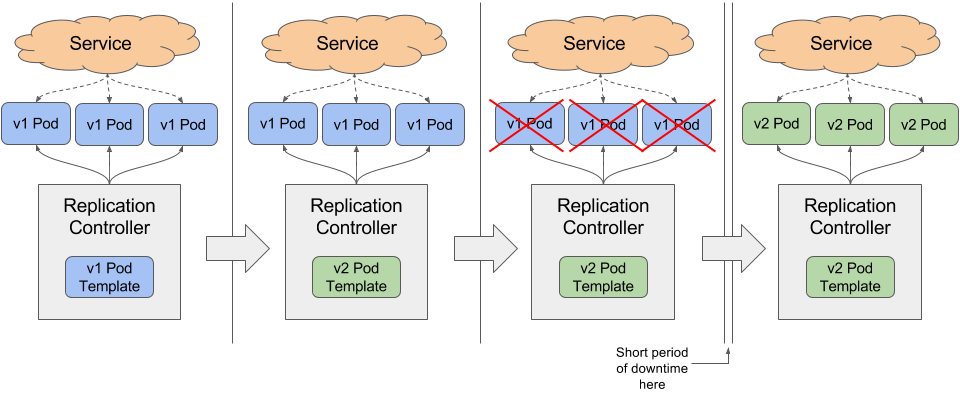
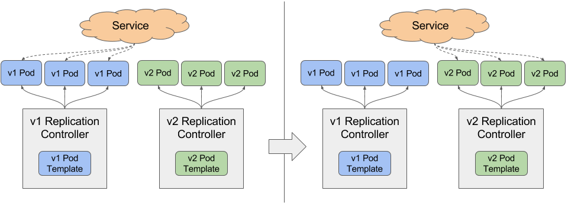
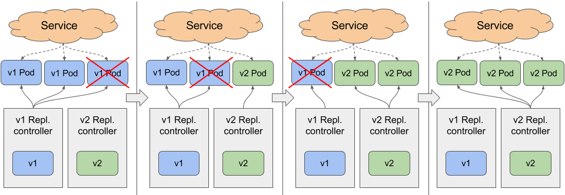
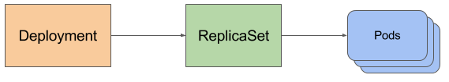
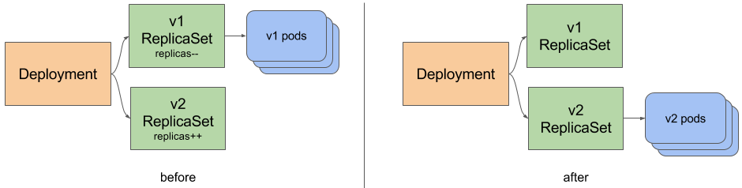
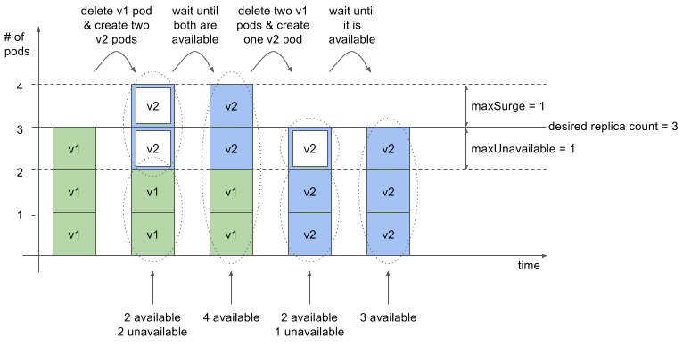
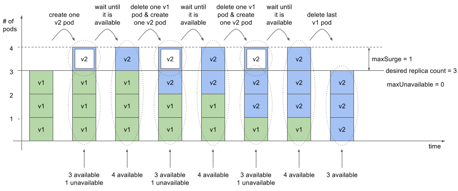

# Stratégies de Déploiement

<!-- .slide: class="page-title" -->


## Agenda de ce chapitre 'Stratégies de déploiement'

<!-- .slide: class="toc" -->

- [Mise à disposition d'une nouvelle version d'un pod](#/new-pod-version)
- [Rolling Update](#/rolling-update)


## Mise à disposition d'une nouvelle version d'un pod

<!-- .slide: id="new-pod-version" -->

- Il existe plusieurs stratégies de mise à jour d'un ensemble de pods


## ReplicaSet FTW (1/2)

- Étape 1 : mettre à jour le template
- Étape 2 : supprimer les pods utilisant l'ancienne version
- Étape 3 : attendre


## ReplicaSet FTW (2/2)



<br/>
L'inconvénient majeur est qu'il faut accepter une interruption de service le temps que le _RS_ crée les pods avec le nouveau template


## ReplicaSet + Service (1/2)

- Étape 1 : créer un nouveau ReplicatSet dédié à la nouvelle version
- Étape 2 : quand tous les pods sont READY, changer le sélecteur du service
- Étape 3 : supprimer le ReplicaSet associé à l'ancienne version


## ReplicaSet + Service (2/2)



<br/>
Inconvénient : nécessite à un moment d'avoir 2 versions de l'application (et donc 2 fois plus de ressources consommées)


## Rolling Update Manuel



<br/>

Inconvénient : nécessite beaucoup d'opérations manuelles...donc source d'erreurs !


## Deployment FTW!




## Descripteur de Deployment

<br/>

```yaml
---
apiVersion: apps/v1 # en k8s v1.9
kind: Deployment
metadata:
  name: kubia
spec:
  replicas: 3
  selector:
    matchLabels:
      app: kubia
  revisionHistoryLimit: 5
  progressDeadlineSeconds: 60
  template:
    metadata:
      labels:
        app: kubia
    spec:
      containers:
        - name: nodejs
          image: luksa/kubia:v1
```


## Deployment status

- Commment savoir si le déploiement s'est bien passé ?

```shell
└> kubectl create -f kubia-deployment-v1.yml --record
```

```shell
$ kubectl rollout status deployment kubia
deployment kubia successfully rolled out
```

```shell
└> kubectl get deploy -l app=kubia
NAME      DESIRED   CURRENT   UP-TO-DATE   AVAILABLE   AGE
kubia     3         3         3            3           16m

```

```shell

└> kubectl get rs -l app=kubia
NAME               DESIRED   CURRENT   READY     AGE
kubia-3842228658   3         3         3         24s
```

```shell
└> kubectl get po -l app=kubia
NAME                   READY     STATUS    RESTARTS   AGE
kubia-3842228658-l0jwc   1/1       Running   0          54s
kubia-3842228658-pd3s9   1/1       Running   0          54s
kubia-3842228658-s5ww2   1/1       Running   0          54s

```


## Mise à jour

<br/>

```shell
└> kubectl get rs -l app=kubia
NAME               DESIRED   CURRENT   READY     AGE
kubia-3842228658   0         0         0         2m
kubia-43373277     3         3         3         52s
```




Notes :

La mise à jour en **v2** se fait avec la commande `kubectl apply -f kubia-deployment-v2.yml --record`


## Autres commandes

- `kubectl rollout history deployment kubia`

```bash
└> kubectl rollout history deploy frontend
deployments "frontend"
REVISION  CHANGE-CAUSE
17        kubectl apply --filename=frontend-b1386-d1387.yml --record=true
18        kubectl apply --filename=frontend-b1391-d1392.yml --record=true
19        kubectl apply --filename=frontend-b1405-d1407.yml --record=true
20        kubectl apply --filename=frontend-b1409-d1410.yml --record=true
21        <none>
22        kubectl apply --filename=frontend-b1414-d1415.yml --record=true

└> kubectl rollout undo deployment frontend ‐‐to‐revision=20

```

- `kubectl rollout undo deployment kubia ‐‐to‐revision=1`


## Controller le "rollout"

- `maxSurge` (défaut 1) : combien d'instances de pod au dessus du nombre de replicas cible on autorise
  - si nb_replicas=3, il n'y aura jamais plus que 4 pods "ready"
- `maxUnavailable` (défaut 1) : combien d'instances de pods peuvent être indisponibles par rapport au nombre de replicas cible
  - si nb_replicas=3, il n'y aura jamais moins de 2 pods "ready"

<br/>

```yaml
spec:
  strategy:
    rollingUpdate:
      maxSurge: 1
      maxUnavailable: 0
    type: RollingUpdate
```


## replicas=3, maxSurge=1, maxUnavailable=1




## replicas=3, maxSurge=1, maxUnavailable=0




## TP 7.1 : Deployments

<!-- .slide: class="page-tp7" -->


<!-- .slide: class="page-questions" -->
