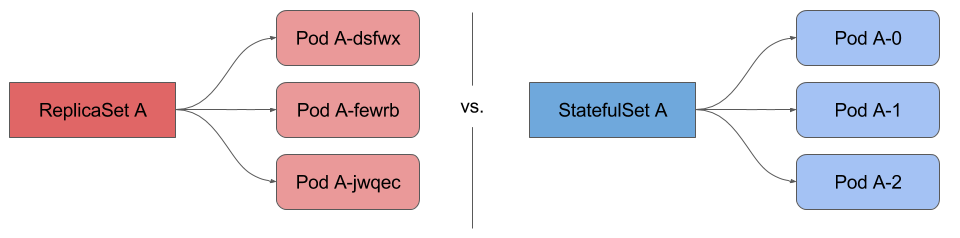
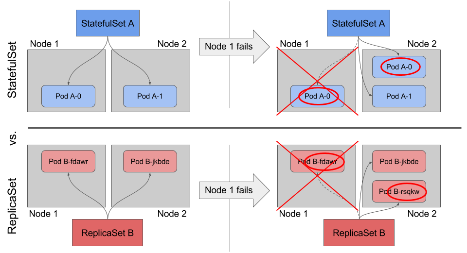
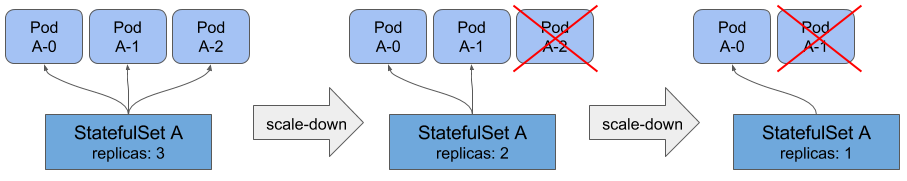
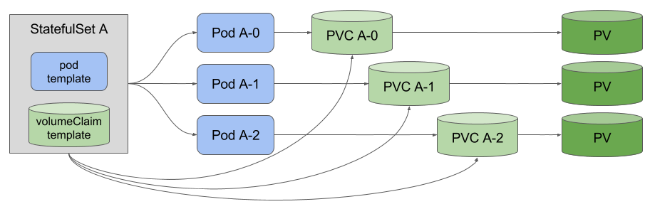
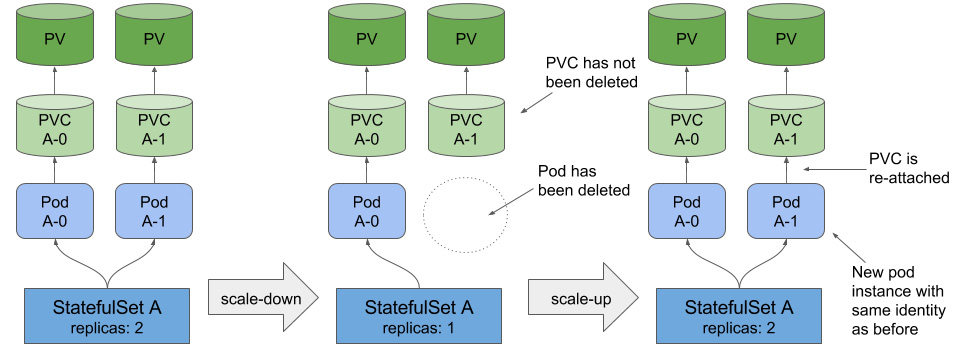

# Statefulsets

<!-- .slide: class="page-title" -->

## Agenda StatefulSet

- [Principes](#/statefulset-principles)

## Principes

<!-- .slide: id="statefulset-principles" -->

- Comment faire si on veut s'assurer de la reproductibilité ?
  - Des pods d'une même appli qui ont besoin de communiquer entre eux
  - de retrouver leur stockage
- Cas d'usage:
  - Consul
  - Elasticsearch
  - Cassandra
- Les _StatefulSet_ maintiennent une _sticky identity_ pour leurs pods

## Préservation de l'identité

Notes :

- Le nom du POD d'un `StatefulSet` est prédictible et conservatif **mais aussi** fait l'objet d'un nom DNS
- Identité : même indexe, même nom réseau, même stockage. 
- L'identité colle au Pod même s'il est redémarré sur un autre noeud.

## Gestion des erreurs

## Mise à l'échelle

## Stockage

## Stockage et ReScheduling

<!-- .slide: class="page-questions" -->
