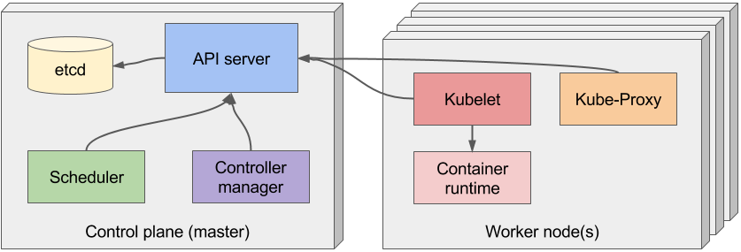

# Architecture et composants

<!-- .slide: class="page-title" -->


## Agenda

- [Composants](#/k8s-components)


## Composants

<!-- .slide: id="k8s-components" -->

2 types de composants :

- le centre de contrôle (`Control Plane`)
- les noeuds (`worker nodes`)


## Le centre de contrôle

- _Etcd_ : stockage distribué persistent (clé/valeur)
- _API Server_ : le point central
- _Scheduler_ : responsable du placement des différentes ressources sur les différents noeuds
- _Controller Manager_ : pilotage des *Controllers


## Les noeuds

- Kubelet : responsable de la création des Pods
- Kubernetes Proxy : gestion des redirections
- Container Runtime (Docker, Rkt, Cri-O) : gestion des containers


## Architecture




```shell

└> kubectl get componentstatus
NAME                 STATUS    MESSAGE              ERROR
scheduler            Healthy   ok
etcd-0               Healthy   {"health": "true"}
controller-manager   Healthy   ok
```


<!-- .slide: class="page-questions" -->
