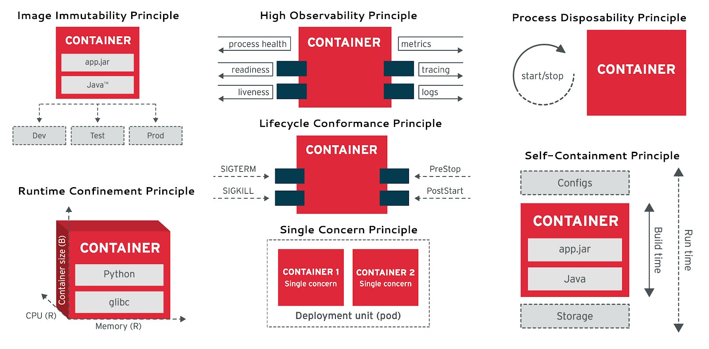
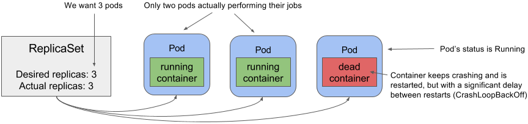
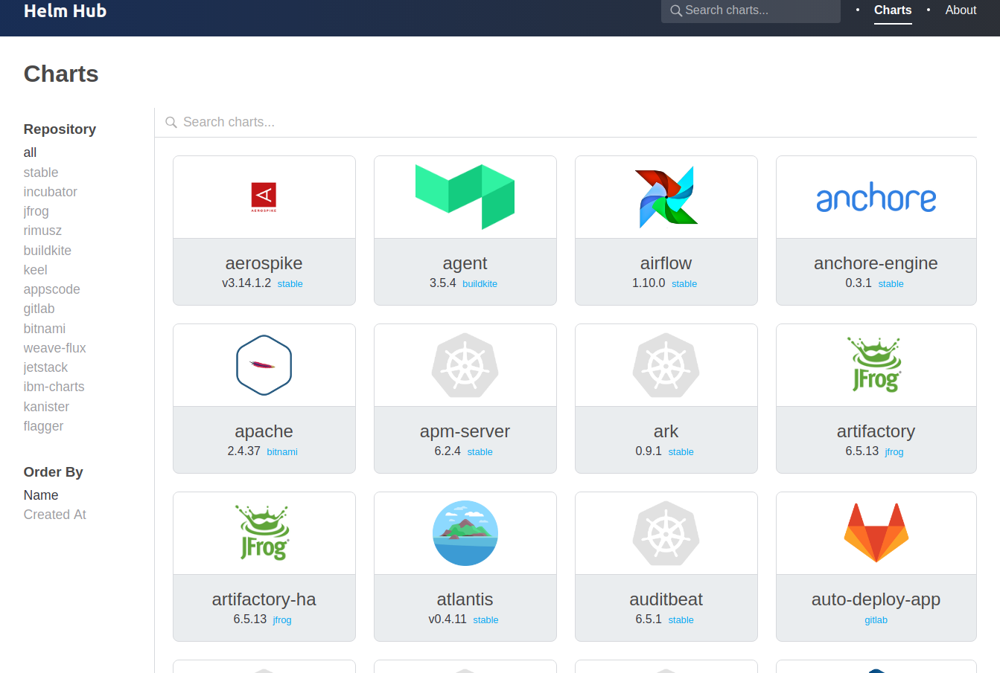

# Développement d'applications compatibles

<!-- .slide: class="page-title" -->


## Agenda

- [Applications Compatibles Kubernetes](#/k8s-ready-apps)
- [Helm pour simplifier vos déploiements](#/helm)


## Applications Compatibles Kubernetes

<!-- .slide: id="k8s-ready-apps" -->



[https://medium.com/@bibryam/cloud-native-container-design-principles-144ceaa98dba](https://medium.com/@bibryam/cloud-native-container-design-principles-144ceaa98dba)


Notes :

TLDR; https://medium.com/@bibryam/cloud-native-container-design-principles-144ceaa98dba
Long: https://www.redhat.com/en/resources/cloud-native-container-design-whitepaper


## ReplicaSet et pods qui crashent en boucle

- Attention, le ReplicaSet est responsable d'avoir un nombre de pods up
- Mais si un pod crash toutes les 5 minutes, ce n'est pas son problème !




## Bonnes pratiques pour vos descripteurs

- Utilisez des `Deployments`
- Configurez des `Readiness Probes` et des `Liveness Probes`
- Utilisez des `Init Containers`
- Réfléchissez 2 fois avant de faire des _Pods_ multicontainers
- Précisez le _ImagePullPolicy_
- Spécifiez les ressources ! (Requests et Limits)
- Utilisez les labels et les annotations
- Utilisez Kubernetes le plus tôt possible !
- Vos descripteurs sont aussi du code, historisez/versionnez les ! (mode déclaratif)


## Pour aller plus loin

<!-- .slide: id="helm" -->

- Installer des ressources Kubernetes devrait être aussi facile que d'utiliser `yum` ou `apt`
- Des équipes différentes devraient pouvoir facilement collaborer
- Les `Releases` devraient être reproductibles
- Les `packages` devraient être facilement partageables


## Qu'est-ce que Helm ?

- `Helm` est un gestionnaire de packages Kubernetes
- `Helm` package plusieurs ressources Kubernetes dans un seul objet de déploiement logique appelé `chart`
- `Helm` propose une gestion de dépendances
- `Helm` simplifie la gestion des ressources Kubernetes en s'appuyant sur un moteur de template
- ... et en proposant un mécanisme de gestion de version au niveau de l'application multi-composants

<br>
<br>
<i class="fa fa-thumbs-o-up" aria-hidden="true"></i> [Helm](https://helm.sh/)


## Chart Helm

- Un `Chart` est un package, un ensemble de ressources Kubernetes (deployments, configmaps, services, ingress, ...)
- Une `Release` est une instance de `Chart` qui a été déployée dans un cluster Kubernetes
- Un `Dépôt` est une collection de `Charts`
- Un `Template` est un modèle de ressource Kubernetes s'appuyant sur le moteur de template `Golang` et la librairie [Sprig](https://godoc.org/github.com/Masterminds/sprig)


## Arborescence d'un chart

```shell

├── Chart.yaml
├── requirements.lock
├── requirements.yaml
├── values.yaml
└── templates
    ├── NOTES.txt
    ├── _helpers.tpl
    ├── config-for-gateway.yaml
    ├── deploy-filter.yaml
    ├── deploy-frontend.yaml
    ├── deploy-gateway.yaml
    ├── deploy--storage.yaml
    ├── ingress-frontend.yaml
    ├── ingress-gateway.yaml
    ├── svc-filter.yaml
    ├── svc-frontend.yaml
    ├── svc-gateway.yaml
    └── svc--storage.yaml
```


## Chart.yaml

```yaml
---
apiVersion: v1
description: A Helm chart to deploy a simple guestbook
name: guestbook
version: 0.1.0
keywords:
  - guestbook
  - springboot
  - redis
  - zenika
maintainers:
  - name: Christophe Furmaniak
    email: christophe.furmaniak@zenika.com
appVersion: 0.6.0
```


## Values.yaml

```yaml
# Default values for guestbook.
# This is a YAML-formatted file.
# Declare variables to be passed into your templates.
storageReplicaCount: 1
filterReplicaCount: 1
gatewayReplicaCount: 1
frontendReplicaCount: 1
replicaCount: 1
image:
  mainVersion: 0.6.0
# You can override individual version if you need to.
# If no specific version is specified, mainVersion is used
  #storageVersion:
  #filterVersion:
  #gatewayVersion:
  #frontendVersion:
initialDelaySeconds:
  shared: 30
#  storage: 30
#  filter: 30
#  gateway: 30
  frontend: 15
ingress:
  gateway:
    host: guestbook-api.192.168.99.100.xip.io
    annotations:
      kubernetes.io/ingress.class: traefik
  frontend:
    host: guestbook.192.168.99.100.xip.io
    annotations:
      kubernetes.io/ingress.class: traefik
```


## Exemple de template

```yaml
    spec:
      containers:
        - name: gateway
          image: looztra/guestbook-gateway:{{ default .Values.image.mainVersion .Values.image.gatewayVersion }}-aio
          ports:
            - name: main
              containerPort: 8080
          envFrom:
            - configMapRef:
                name: {{ template "gateway.fullname" . }}
              prefix: GATEWAY_
          livenessProbe:
            httpGet:
              path: /admin/info
              port: 8080
            initialDelaySeconds: {{ default .Values.initialDelaySeconds.shared .Values.initialDelaySeconds.gateway }}
            timeoutSeconds: 1
            failureThreshold: 3
```


## Charts

Dépôt de Charts publiques <https://hub.helm.sh/charts/>




## TP 8.1 : Premiers pas avec Helm

<!-- .slide: class="page-tp8" -->


<!-- .slide: class="page-questions" -->
