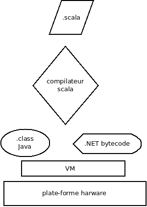

# Historique et concepts

<!-- .slide: class="page-title" -->

## Historique

- 2001 : Création du langage par Martin Odersky
- 2003 : 1.0
- 2006 : 2.0
- 2008 : 2.8
- 2011 : 2.09 - création de TypeSafe
- fin 2012 : 2.10
- juin 2015 : 2.11.7
- février 2016 : TypeSafe devient LightBend
- janvier 2016 : 2.12

## Points clés

- Fournir un langage fonctionnel de nouvelle génération
  - Pas un langage fonctionnel pur comme Haskell
  - Support des concepts objets
  - Interopérable avec Java *(et .NET)*
- Fusion entre approche fonctionnel et impérative orienté objet
- Supporter les concepts clés de la programmation fonctionnelle dans un contexte orienté performance
  - D'où le nom Scala pour *sca*lable *la*nguage
  - Immutabilité
  - Récursivité et tail recursion
  - Support du  design pattern **Actor**
  - Closures

## Pourquoi un langage au-dessus de la JVM ?

- Bénéfices de l'expérience de la JVM :

  - Tuning de HotSpot après plus de 15 ans de R&D
  - Nombre important de librairies Java
  - Qualité de l'outillage de développement

<!-- .element style="width: 65%" -->

<figure style="float:right">
   
</figure>

## Pourquoi choisir Scala?

- Contexte agile
  - Utilisation du REPL
- Qualité logicielle 
  - Compilateur plus exigeant
  - Concision du langage
  - **Moins de code implique moins  de bugs** :)
- Outils et frameworks 
  - SBT, Activator
  - Spark, Kafka, Akka, Lagom

## Comment passer à Scala ?

- **Pas de mapping direct Java – Scala**
- Il faut adopter une nouvelle manière de penser:
  - Approche fonctionnelle
- Appréhender la syntaxe,
- La difficulté vient du passage de ce gap pour le reste Scala est assez proche de Java.

## Ce qu'il faut retenir

- Programmation fonctionnelle,
- Interopérabilité avec Java,
- Axé performance,
- Concision et expressivité du code.
