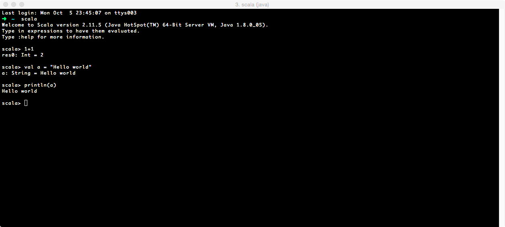
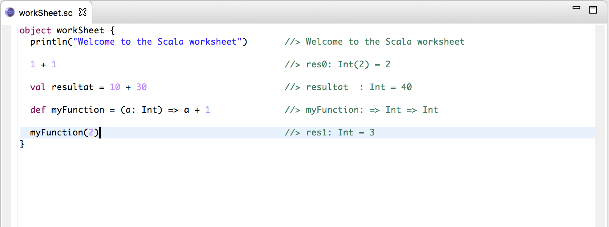
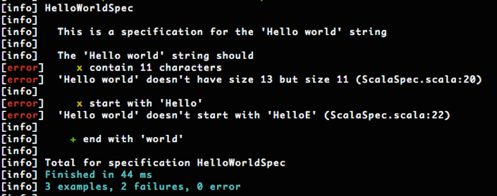

# Environnement<br>de travail

<!-- .slide: class="page-title" -->


## Sommaire

- Le REPL
- IDE
- SBT : Simple Build Tool
- Frameworks de tests en Scala : ScalaTest, Specs 2
- Scaladoc : outil de documentation standard


## Le REPL

- *R*ead-*E*valuate-*P*rint *L*oop
- Permet d'exécuter du code à la volée
- Outil fournit avec l'installation Scala


## Le REPL

<figure>
     
</figure>


## Le REPL pour quoi faire ?

- Excellent outil d'apprentissage permettant de se familiariser avec le langage et d’appréhender son mécanisme de typage fort
- Tester rapidement du code
- Pratique et économique en ressources
- Convient plus à des fonctions simples qu'à tester des designs entiers avec des classes / traits
- Ce n'est pas une exclusivité de Scala, *Haskell* dispose aussi d'un REPL et bientôt Java 9


## IDE

- **Eclipse** propose un plugin Scala,
- **Scala-IDE**, basé sur Eclipse Luna sponsorisé par LightBend (ex :TypeSafe)
- **IntelliJ Idea** intègre  Scala et SBT en standard depuis version 11
- **NetBeans** propose un plugin Scala (plus supporté aujourd'hui)
 


## IDE : Worksheet

- Un REPL graphique interactif
- Auto complétion
- Sauvegarde des résultats possibles

<figure>
     
</figure>


## SBT : Simple Build Tool

- Comparable à Maven & Gradle
- Un outil de build pour Scala, Java
- Basé sur le principe de *Convention Over Configuration*


## SBT : Principales fonctionnalités

- Shell
- Compilation incrémentale
- Continuous Tasking
- Exécution en parallèle des tâches
- Gestion de projet simple ou multi-projets
- Support natif des principaux frameworks de tests Scala (Junit via un plugin)
- Exécution intelligente des tests
- Démarrage du REPL avec l'ensemble des classes chargées, ainsi que les dépendances


## SBT : Type de projet géré

- **Projets simples** (1 seul artefact produit / 1 seul module)
  - Syntaxe déclarative, SBT gère le reste
  - Descripteur non obligatoire
- **Projets composites** : multi modules
   - Chaque projet à son propre scope déclaratif
   - Configuration factorisable entre les projets 
   - Dépendance entre les projets 


## SBT : Conventions

- Les sources peuvent être stockées à différents endroits :
  - répertoire de base
  - dans `src/main/scala` ou `src/main/java`
- Tests se trouvent :
  - dans `src/test/scala` ou `src/test/java`
- Fichiers de données :
  - dans `src/main/resources` ou `src/test/resources`
- les dépendances dans `lib` (non managées)


## SBT : Un projet simple

- Exemple :
  - Ci-dessous un programme affichant le classique 'Hello World' :
```scala
object Hw {
 def main(args: Array[String]) =
   println("Hello World")
}
```
  - Arborescence du projet :
```text
myProject/
└── Hw.scala
```


## SBT : Un projet simple

- Exécution de projet :

```shell
myProject> sbt run
```

- Sortie du programme :

```text
[info] Set current project to myproject (in build file:/Users/fsznajderman/Dev/myProject/)
[info] Compiling 1 Scala source to /Users/fsznajderman/Dev/myProject/target/scala-2.10/classes...
[info] Running Hw
Hello World
[success] Total time: 3 s, completed 7 oct. 2015 00:22:56
```


## SBT : Structure standard 

- SBT respecte la structure définie par Maven.
- Valable pour un projet ou un sous module

```text
myProject/
   ├── project
   │   ├── plugins.sbt
   │   ├── build.properties
   │   └── ...
   ├── lib (unmanaged dependencies)
   ├── src
   │   ├── main
   │   │   ├── java
   │   │   ├── resources
   │   │   └── scala
   │   └── test
   │       ├── java
   │       ├── resources
   │       └── scala
   └── build.sbt
```


## SBT : Build.sbt

- Descripteur du projet
- Exemple :

```scala
val scalaTest = "org.scalatest" % "scalatest" % "1.9.1" % "test"

lazy val root = (project in file(".")).
    settings(
      name := "HelloW",
      organization := "com.example",
      version := "0.1.0",
      scalaVersion := "2.11.4"
      libraryDependencies += scalaTest
    )
```


## SBT : Un projet multi-module

- Un seul descripteur à la racine du projet

```scala
lazy val moduleA = (project in file("moduleA"))

lazy val moduleB = (project in file("moduleB")).dependsOn(moduleA)
```

```text
myProject/
   ├── project
   ├── moduleA
   │   └──src
   │       ├── main
   │       └── test
   ├── moduleB
   │   └──src
   │       ├── main
   │       └── test
   └── build.sbt
```


## SBT : Build.sbt

- La version du compilateur Scala peut être définit dans le descripteur build.sbt
- Pas d'installation préalable de Scala nécessaire.
- SBT va récupérer la version du compilateur Scala en tant que dépendance
- Par défaut la librairie standard Scala est ajoutée au `classpath`
- Si l'on souhaite la configurer manuellement, il faut positionner le paramètre suivant à false

```scala
autoScalaLibrary := false
```

- Les archives du compilateur sont stockées dans le repository local (`.ivy2`)


## SBT : Déclaration d'une dépendance

- Gestion des dépendances avec Apache Ivy
- Format pour la déclaration d'une dépendance :
```text
libraryDependencies += groupID % artifactID % revision
```
- Possibilité de gérer manuellement ses dépendances.
  - Ce sont des **unmanaged dependencies**.
  - Elles doivent être placées dans le répertoire `lib` (par défaut)


## SBT : Déclaration d'une dépendance

- Il est possible de gérer plus finement les versions des dépendances avec SBT.

- En doublant le séparateur, comme dans l'exemple ci-dessous
```text
libraryDependencies += groupID %% artifactID % revision
```
- SBT va rechercher la librairie adaptée à la version de compilateur Scala définie dans le build.sbt
- Cette fonctionnalité s'applique uniquement aux librairies construite avec SBT


## SBT : Déclaration d'une dépendance

- Il est également possible de contrôler finement le numéro de révision de la librairie importée.

- Par exemple, si l'on souhaite systématiquement se baser sur la dernière version d'intégration, on utilisera :

```scala
libraryDependencies += "org.foobar" %% "foobar" % "latest.integration"
```
- Il est également possible d'utilise des plages de version :

- Pour le numéro de révision on peut écrire : `[1.0,2.0]`, ce qui indique le postula suivant :
  - match avec toutes les version `=< 1.0` et `=< 2.0`

- D'autres opérateurs disponibles comme `+`


## SBT : Plugins

- Système ouvert basé sur des plugins
- Liste des plugins disponibles : http://www.scala-sbt.org/release/docs/Community-Plugins.html


## SBT : Plugins

- Plugins disponibles :
  - *IDE*
    - IDEA
    - Eclipse
    - Sublime
  - *Tests*
    - xsbt-cucumber-plugin
    - sbt-testng-interface
    - junitxmllistener
  - *Code coverage*
  - *Static code analysis*
  - etc

<!-- .element: class="reduce-size" -->


## SBT : Plugins

- Configuration des plugins via le fichier :

```text
myProject/
   ├── project
   │   └── plugins.sbt
   └── build.sbt
```

- Exemple de configuration d'un plugin :

```scala
addSbtPlugin("org.example" % "another-plugin" % "2.0")
```


## SBT : Resolvers

- Lorsque une dépendance ou un plugin est hébergé sur un dépôt spécifique non standard
- Exemple d'ajout d'un resolver :

```scala
  resolvers += "Sonatype OSS Snapshots" at "https://oss.sonatype.org/content/repositories/snapshots"
```


## SBT : Aide en ligne

- Une aide accessible via la ligne de commande :
```shell
sbt help
```
- Permet à d'obtenir des détails sur le projet courant (plugins, tasks, etc).
- Plus de détails sur une commande en particulier avec :
```shell
sbt help [commande]
```


## SBT : Aide en ligne

- Exemple : `sbt help tasks`

```text
...
clean            Deletes files produced by the build,
                such as generated sources, compiled classes, and task caches.
compile          Compiles sources.
console          Starts the Scala interpreter with the project classes
                on the classpath.
consoleProject   Starts the Scala interpreter with the sbt and
                the build definition on the classpath and useful imports.
consoleQuick     Starts the Scala interpreter
                with the project dependencies on the classpath.
copyResources    Copies resources to the output directory.
doc              Generates API documentation.
package          Produces the main artifact, such as a binary jar.
                This is typically an alias
                for the task that actually does the packaging.
packageBin       Produces a main artifact, such as a binary jar.
packageDoc       Produces a documentation artifact, such as
                a jar containing API documentation.
packageSrc       Produces a source artifact, such as
                a jar containing sources and resources.
publish          Publishes artifacts to a repository.
publishLocal     Publishes artifacts to the local Ivy repository.
publishM2        Publishes artifacts to the local Maven repository.
...
```
<!-- .element: class="reduce-size" -->


## Test : Librairies disponibles

- Test-NG
- Junit
- **ScalaTest**
- **Specs2**


## Test : SBT configuration

- Dans le fichier **build.sbt**

```scala
val scalaTest = "org.scalatest" % "scalatest_2.10" % "2.0" % "test"
val scalaSpec = "org.specs2" % "specs2-core" % "3.6.4" % "test"

lazy val root = (project in file(".")).
  settings(
    version := "0.1.0",
    scalaVersion := "2.10.4",
    libraryDependencies += scalaTest,
    libraryDependencies += scalaSpec
  )
```


## Test : localisation dans le projet

- A la manière de la convention Maven, un projet stockera ses tests unitaires dans l'un des répertoires suivants :

```
myProject/
   ├── project
   │   ├── plugins.sbt
   │   ├── build.properties
   │   └── ...
   ├── lib (unmanaged dependencies)
   ├── src
   │   ├── main
   │   │   ├── java
   │   │   ├── resources
   │   │   └── scala
   │   └── * test
   │       ├── * java
   │       ├── resources
   │       └── * scala
   └── build.sbt
```


## Test : ScalaTest

- Approche similaire à celle de JUnit
- Utilisation principalement d'assertions
- Ouvert sur de nombreux outils du marché comme :
  - Mockito,
  - Junit,
  - TestNG
  - etc


## Test : ScalaTest librairie

- Propose plusieurs styles pour rédiger les TUs. Chaque approche répond à un besoin particulier.

  - `FunSuite` : Proche du style xUnit
  - `FlatSpec` : Introduction à BDD
  - `FunSpec` : Concept tiré de Ruby's RSpec tool
  - `WordSpec` : Utile aux développeurs venant du monde Spec / Spec2 (approche DBB)
  - Liste exhaustive : http://www.scalatest.org/user_guide/selecting_a_style


## Test : FunSuite exemple

- Exemple :

```scala
import org.scalatest.FunSuite

class SetSuite extends FunSuite {

  test("An empty Set should have size 0") {
    assert(Set.empty.size == 0)
  }

  test("Invoking head on an empty Set should produce NoSuchElementException") {
    intercept[NoSuchElementException] {
      Set.empty.head
    }
  }
}
```

- Résultat :

```text
[info] SetSuite:
[info] - An empty Set should have size 0
[info] - Invoking head on an empty Set should produce NoSuchElementException
```


## Test : Flatspec

- Exemple :

```scala
import org.scalatest.FlatSpec

class SetSpec extends FlatSpec {

  "An empty Set" should "have size 0" in {
    assert(Set.empty.size == 0)
  }

  it should "produce NoSuchElementException when head is invoked" in {
    intercept[NoSuchElementException] {
      Set.empty.head
    }
  }
}
```


## Test : Flatspec

- Résultat :
```text
[info] SetSpec:
[info] An empty Set
[info] - should have size 0
[info] - should produce NoSuchElementException when head is invoked
[info] Run completed in 366 milliseconds.
[info] Total number of tests run: 2
[info] Suites: completed 1, aborted 0
[info] Tests: succeeded 2, failed 0, canceled 0, ignored 0, pending 0
```


## Test : Scala Specs2 librairie

- Basé sur l'approche Behavior Driven Development (BDD)
- Les tests décrivent le fonctionnement attendu des composants testés littéralement
- Propose un DSL riche


## Test : Scala Specs2

- Exemple :

```scala
import org.specs2._

class HelloWorldSpec extends Specification {
  def is = s2"""

  This is a specification for the 'Hello world' string

  The 'Hello world' string should
    contain 11 characters                             $e1
    start with 'Hello'                                $e2
    end with 'world'                                  $e3
                                                      """

  def e1 = "Hello world" must haveSize(13)

  def e2 = "Hello world" must startWith("HelloE")

  def e3 = "Hello world" must endWith("world")
}
```


## Test : Scala Specs2

- Exemple :

<figure>
     
</figure>


## ScalaStyle : Conformation avec la norme

- Outil proche de CheckStyle du monde Java
- Génère des rapports XML compatibles avec CheckStyle
- On peut donc utiliser les mêmes outils pour générer des
  rapports HTML envoyés par mail
-  Pour l'utiliser 2 étapes :
  - Modifier le fichier project/plugins.sbt : `addSbtPlugin("org.scalastyle" %% "scalastyle-sbt-plugin"% "0.2.0")`
  - `resolvers += "sonatype-releases" at "https://oss.sonatype.org/content/repositories/releases/"`
- Injecter la configuration dans votre build.sbt
  - `org.scalastyle.sbt.ScalastylePlugin.Settings`
- Lancement de l'analyse : `sbt scalastyle-generate-config`


## Documentation : Scaladoc

- Outil de génération de documentation HTML
- Fortement inspiré de Javadoc
- Générée par l'outil **scaladoc**
- Plus riche mais moins plus complexe
- Moteurs de recherche interne
- [http://www.scala-lang.org/api/current/#package](http://www.scala-lang.org/api/current/#package)


## Environnement de travail : Conclusion

- Nous avons vu dans ce chapitre :
  - L'utilisation du REPL et des IDEs
  - Simple Build Tool (SBT)
  - Comment écrire des tests
  - Comment créer la documentation du code


## TP1 : Installer et configurer son environnement

<!-- .slide: class="page-tp1" -->
