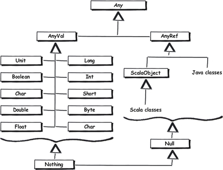

# Le langage Scala

<!-- .slide: class="page-title" -->


## Sommaire

- La syntaxe du langage
- Principaux éléments du langage
- Gestion des imports et packages
- Pattern matching
- Fonctions au coeur du langage
- Hiérarchie de classes


## Le langage Scala : Généralités

- Le `;` est optionnel
- Définition des fonctions plus précise
- Pas de contraintes quant à refléter le découpage logique en packages de manière arborescente sur le disque
- Pas de contraintes quant au mapping entre classes et noms de fichiers
- Une exception avec le cas des 'companion object'


## Le langage Scala : Généralités

- Caractéristiques clés du langage :

  - Syntaxe proche de celle de Java
    - Plus concise
  - Fortement typé
    - Inférence du type
  - Langage fonctionnel 'impur'
    - Support de variables mutables ou immutables
    - 2 types de collection mutable et immutable


## Le langage Scala : La syntaxe

- Première version proche de l'esprit de Java

```scala
object HelloWorld {
  def main(args:Array[String]){
    println("Hello world")
  }
}
```


## Le langage Scala : La syntaxe

- Deuxième version plus concise

```scala
object Hello extends App{
  println("Hello World")
}
```


## Le langage Scala : La syntaxe - Les variables

- Déclaration d'une variable

```scala
val immutable= "World"

var mutable = "hello"

mutable += immutable

immutable+= "impossible" // compiler error!
```


## Le langage Scala : La syntaxe - Les fonctions

- Déclaration d'une fonction

  - Format général : `def <name> ([params]):[type retour] = <body>`

- Exemples :

```scala
def maFunction(p:Int):String = p.toString

def maFunction(p:Int):Unit = p.toString

def maFunction() = println("commentaire")

def maFunction(a:Int, b:Int) = a+b

def maFunction(a:Int, p:Int => Int) = p(a)
```


## Le langage Scala : La syntaxe - les fonctions

- Déclaration d'une fonction *anonyme*

- Format général : `([liste params]) => <type retour>`

  - Ce format représente le type de la fonction
  - Format couramment utilisé
  - Nom : *Littéral de fonction* ou *fonction anonyme*


## Le langage Scala : La syntaxe - les fonctions

- Exemples :

```scala
() => Int  // fonction sans paramètre renvoyant un entier

String => Int // fonction avec 1 paramètre de type String renvoyant un entier

(String, Int, Int => Int) => Double // 3 params dont une fonction renvoyant un double
```


## Le langage Scala : La syntaxe - les paramètres de fonction

- En Scala, il est possible de fixer des valeurs par défaut pour les paramètres d'une fonction.

- Exemples :

```scala
def f(a:Int=100, b : Int = 50) = println(a+b)

f() //> 150

f(a=12) //> 62

f(b=25) //> 125

f(10,10) //> 20
```


## Le langage Scala : La syntaxe - les tuples

- Les tuples permettent de lier des valeurs

  - Nombre d'éléments dans le tuple : `n`
  - Accès à l'élément n du tuple via la méthode `_n`
  - Les éléments du tuple peuvent être hétérogènes
  - `(String,Int,Boolean)` par exemple pour un tuple à 3 éléments
  - À la différence d'une liste contenant des éléments homogènes


## Le langage Scala : La syntaxe - les tuples

- Exemples :

```scala
(1,2) // tuple contenant 2 éléments de type entier

(1,"hello") // tuple contenant 2 éléments de type différent

val t = (1,"hello", 3.0) // tuple contenant 3 éléments de type différent

println(t._1)   // 1

println(t._3)   // 3.0
```


## TP2 : Les bases du langage

<!-- .slide: class="page-tp2" -->


## Le langage Scala : Type Option

- Option est un type abstrait permettant de caractériser la présence ou l'absence d'une valeur
- Il possède deux sous-types
  - `Some` : La présence d'une valeur
  - `None` : L'absence d'une valeur
- Permet d'adresser la problématique des références nulles
- Ce type est largement utilisé dans le langage


## Le langage Scala : Type Option

- Prenons une exemple basé sur le type `Map` (Collection représentant un ensemble de clés/valeurs)

```scala
val m = Map(1-> "un",2-> "deux",3-> "trois")

println(m.get(1)) // Some(un)
println(m.get(4)) // None

println(m.get(1).get) // un
```


## Le langage Scala : Type Option

- Utilisation avancée

```scala
val m = Map(1-> "un", 2-> "deux", 3-> "trois")

// on evite ici les structures conditionnels
println(m.get(1).getOrElse("pas de valeur!")) // un

println(m.get(4).getOrElse("pas de valeur!")) // "pas de valeur!"

println(m.get(2).map(v => "La valeur " + v + " à été trouvée")
    .getOrElse("pas de valeur!"))  // La valeur deux à été trouvée

println(m.get(4).map(v => "La valeur " + v + " à été trouvée")
    .getOrElse("pas de valeur!"))  // pas de valeur!

```


## Le langage Scala : package & imports

- Packages : principes & utilisation

  - Notion issue des namespaces C++ et des packages Java
  - Permet d'éviter les conflits de nommage
  - Peut s'utiliser de différentes manières :
    - Comme en Java, avec un respect de la hiérarchie de modules sur le disque (arborescence)
    - Comme en C#, avec des packages emboîtés les uns dans les autres indépendamment de l'arborescence sur le disque.
  - Plus souple qu'en Java standard


## Le langage Scala : package & imports

- Imports : principes & utilisation

  - Même mot clé qu'en Java pour désigner les classes/méthodes nécessaires dans votre code
  - Plus souple qu'en Java
    - `import java.util.**_**` (remplace le joker Java)
    - `import p1.{A => B}` renommer la classe importée
    - `import p1.{A,B,C}` pour importer les classes A,B,C de p1
  - Les imports peuvent être insérés au fil de l'eau et pas
  seulement en début de fichier


## Le langage Scala : Use case

- Imports : renommer une classe importée

  - Cas de `java.util.Date` & `java.sql.Date`
  - `import java.util.{Date => DateUtil}`
  - `import java.sql.{Date => DateSql}`


## Le langage Scala : package & imports

- Imports : Exemple

```scala
package com.scala

import org.sample.other.pack.MyService  // import

class MainProg {

  def main(args: Array[String]): Unit = {
    import org.sample.pack.UtilClasse //import

    val l = List()

    val uc = new UtilClasse()
    println(uc.choseUtile(1))

    println(MyService.serverSomething())
  }

}
```


## Le langage Scala : Hiérarchie de classes

- Plus de types basiques non objets
- Encapsulation des classes Java existantes en tant que `AnyRef`
- `Nothing` & `Null` héritent de toute classe Scala

<figure>
   
</figure>


## Le langage Scala : Hiérarchie de classes

- **AnyRef**

  - Équivalent du `java.lang.Object`
  - On retrouve certaines de ses mêmes méthodes
    - `equals`
    - `hashCode`
  - Introduction de méthodes helper :
    - `eq`
    - `ne`


## Le langage Scala : Classes

- Concision avec génération guidée des éventuels accesseurs
- Support de la convention JavaBean avec une annotation `@BeanProperty`
- Contrôle de la visibilité des membres plus précis/fin qu'en Java


## Le langage Scala : Classes - constructeur

- Constructeur principal

  - Intégré à la définition de la classe
  - Code du constructeur placé directement dans le cœur de la classe

```scala
// constructeur principal a 3 arguments dont 2 immuables
class Employee (val id:String, val name:String, var job:String) {

  // code du constructeur principal...
  println("Constructing an employee")

}
```


## Le langage Scala : Classes - constructeur

- Exemple :

```scala
val p = new Employee("1", "toto","dev")           // Constructing an employee

p.id                                              // 1
p.name                                            // toto
p.job                                             // dev
p.job = "dba"
p.job                                             // dba
p.id = 38 //erreur de compilation
```


## Le langage Scala : Classes - multiples constructeurs

- Un seul constructeur principal
- Constructeurs secondaires invoquent le constructeur principal

```scala
class Employee(val id:String, val name:String ,var job:String) {

  println("constructeur principal")

  // constructeur secondaire
  def this (id:String ,name: String){
    this(id,name,"Slave")
  }

}
```


## Le langage Scala : Égalités sémantique & de références

- Pour une classe (hors case classes) Scala fournit une implémentation de `equals`/`hashCode` similaire avec celle de Java.
- C'est à nous de donner du sens à la comparaison **sémantique** de 2 objets
<br><br>

<!-- .element class="alert alert-danger"-->
Rappel : Toujours implémenter les 2 méthodes


## Le langage Scala : Égalités sémantique & de références

- Exemple :

```scala
class Person(name:String)

object Person extends App {

  val p1 = new Person("tata")
  val p2 = new Person("tata")

  println(p1.ne(p2))  // true

  println(p1==p2 )  // false
  println(p1.eq(p2))  // false
  println(p1.equals(p2)) // false
}
```

- Pas d’égalité sémantique
- Pas d’égalité par référence, c'est normal


## Le langage Scala : Égalités sémantique & de références

- Reprenons classe `Person` de manière à ajouter les implémentations de `equals()` et `hashCode()` :

```scala
class Person(namep:String){

  val name = namep

  def canEqual(other: Any): Boolean = other.isInstanceOf[Person]

  override def equals(other: Any): Boolean = other match {
    case that: Person =>
      (that canEqual this) &&
        name == that.name
    case _ => false
  }

  override def hashCode(): Int = {
    val state = Seq(name)
    state.map(_.hashCode()).foldLeft(0)((a, b) => 31 * a + b)
  }
}
```


## Le langage Scala : Égalités sémantique & de références

- Ré-exécution du code :

  - Egalité **sémantique** avec l'opérateur `==` (contrairement à Java) et `equals`
  - les méthodes `eq` et `ne` assurent une égalité **référentielle**

```scala
println(p1.ne(p2))         // true

println((p1==p2) )         // true

println(p1.eq(p2))         // false
println(p1.equals(p2))     // true
```


## Le langage Scala : Traits - notions

- Proche des interfaces Java
- Peut contenir des méthodes implémentées
- Beaucoup de traits au cœur du langage
- Héritage multiple de traits


## Le langage Scala : Traits - utilisation

- S'utilisent d'une manière similaire à une interface en Java
- Si la classe n'hérite pas explicitement d'une autre, alors héritage du trait avec le mot clé `extends`
- Dans les autres cas utilisation du mot clé `with`


## Le langage Scala : Traits - utilisation

Exemple :

```scala
 trait MySimpleTrait {
  def foo():Unit ={println("Hi from foo")}
 }

 trait MyOtherTrait{
   def foobar():Unit={println("foobar invoked")}
 }

 class FirstUsage extends MySimpleTrait

 class SecondUsage extends AnyRef with MySimpleTrait with MyOtherTrait{}

 object LaunchTraitsSample extends App {
   def first = new FirstUsage
   def second = new SecondUsage
   first.foo()                      // Hi from foo
   second.foo()                     // Hi from foo
   second.foobar()                  // foobar invoked
 }
```


## Le langage Scala : Traits - utilisation

- Dans l'exemple précédent on a utilisé les traits de manière statique.
- Il est possible d'utiliser un trait de manière **dynamique**.
- On va pouvoir faire bénéficier un objet du comportement d'un trait au moment de son instanciation.

```scala
trait OneTrait {
   def foo(): Unit = { println("Hi from OneTrait.foo") }
}

val p = new Person("Michel") with OneTrait
println(p.foo())   // Hi from OneTrait.foo
```


## Le langage Scala : Implicit - Conversion

- Soit la classe `Rational` définie ci-dessous
- Elle propose une fonction (`+`) permettant d'additionner deux `Rational`

```scala
class Rational(num:Int,den:Int) {
   require (den!=0)
   val n:Int = num
   val d:Int = den

   def +(that:Rational):Rational={new Rational(n*that.d + that.n*d ,d*that.d)}

   override def toString()={num + "/" + den}
}
```


## Le langage Scala : Implicit - Conversion

- Exemple d'utilisation

```scala
val r1 = new Rational(1,2)
val r2 = new Rational(3,4)
val r3 = r1+r2 // jusqu'ici tout va bien

// Que se passe t'il si j'écris

val r4 = r3 + 1 // erreur de compilation
```


## Le langage Scala : Implicit - Conversion

- Pour adresser ce problème, la solution standard en Scala est l'utilisation d'`implicit`
- Pour cela il faut définir la conversion `Int` -> `Rational`

```scala
object Number2RationalImplicit {
    implicit def int2Rational(value:Int)=new rational(value,1)
}
```

- Ce convertisseur est stocké dans un object et pourra être importé partout où l'on aura besoin de manipuler des rationnels et des entiers


## Le langage Scala : Implicit - Conversion

- Exemple :

  - Le compilateur va détecter l'erreur.
  - Il va maintenant trouver dans son scope le convertisseur implicit et résoudre le problème à la compilation

```scala
import  Number2RationalImplicits._

val r1 = new rational(2,1)

println( r1 + 1 ) // résultat : 3/1
```


## Le langage Scala : Implicit - Conversion

- Les **implicits** sont un outils très puissant
- Attention à ne pas en abuser car cela introduit une forme de complexité
- Ils influent également sur les performances du compilateur


## TP3 : Les structures du langage

<!-- .slide: class="page-tp3" -->


## Le langage Scala : Pattern matching

- Une des structures du langage les plus fréquemment utilisées
- Très pratique et puissant
- Beaucoup plus puissant qu'un 'switch case' en Java
- Structure générale :

```scala
(variable) match {
  case (cas1) => (faire qqch)
  case (cas2) => (faire AutreChose)
}
```


## Le langage Scala : Pattern matching

- Exemples :

```scala
val choice = 2
choice match {
  case 1 | 2 | 3 => "yes"
  case 0 => "no"
  case _ => "error"
}
```

```scala
// r:Option[Int]
r match {
  case Some(v) => "contient " + v
  case None => "ne contient rien"
}
```

```scala
// r:List[Int]
r match {
  case head::tail => "premier élément " + head
  case Nil => "liste vide"
}
```

- Structure plus puissante conjuguée avec les **case classes** ou **tuples**


## Le langage Scala : Case classe

- Déclaration simplifiée
- Exposition des paramètres du constructeur
- Attribut en lecture seul
- Constructeur sans l’opérateur `new`
- `Equals` & `hashcode`, `toString` fournis par défaut
- Décomposable


## Le langage Scala : Case classe

- Exemple :

```scala
case class Person(name:String, age:Int)

val p1 = Person("Michel", 33)// Person(Michel,33)
val p2 = Person("Louis", 34)  // Person(Louis,34)
val p3 = Person("Michel", 33) // Person(Michel,33)

p1.name                       // Michel
p1.name = "Bertrand"          // Erreur :  name est imutable

p1 == p2                      // false
p1 == p3                      // true
```


## Le langage Scala : Pattern matching & case classe

- Exemple :

```scala
abstract class Command{
  def doExecute():Unit
}
```
```scala
case class TakeOffCommand (val name:String, val payload : String) extends Command{
  override def doExecute() = println("about coming back to the ground"

  final override def toString() = "Command("+ name + " with payload ="+payload+")"
}
```
```scala
case class UnknownCommand (val name:String, val payload : String) extends Command{
   override def doExecute() = println("Can't do anything with that !")
}
```
```scala
case class PostburnModeCommand (val name:String, val payload : String) extends Command{
  override def doExecute() = println("supersonic mode is ON")
}
```

- Déclaration de plusieurs case classes ayant chacune la responsabilité d'un type de commande


## Le langage Scala : Pattern matching & case classe

- Exemple :

```scala
class FlightSimulatorCommandProcessor {
  def processCommand(cmd : Command )={
    cmd match {
        case TakeOffCommand(_,_) => println("flight is over")
        case PostburnModeCommand(_,_) => println("Yaouhhh!")
        case UnknownCommand(name,_) if(name=="SOS") => println("Mayday mayday")
        case UnknownCommand(_,_) => println("Can't do anything with that")
    }
  }
}
```

- Permet d'aiguiller suivant certaines valorisations des clauses et d'ajouter des clauses

```scala
case (…) if (condition) => action
```


## Le langage Scala : Exception

- Outillage proche de celui proposé par Java
- Structure du type try/catch
- Pas d'obligation de traiter les exceptions
  - Allégement du code
- Gestion des erreurs dans le try par pattern matching


## Le langage Scala : Call by name & Call by value

- 2 modes d'évaluation des paramètres passés aux méthodes
   - Call by **value**, paramètres évalués en entrée de méthode
   - Call by **name**, évaluation à chaque utilisation du paramètre


## Le langage Scala : Call by name & Call by value

- Exemple : **Call by value**

```scala
class Time{
  def time():Long={
    println("Invoking time()")
    System.nanoTime()
  }

  def printTimeStd(f:Long)={
    println("starting printing time")    // starting printing time
    println( "1rst Call : " + f)         // 1rst Call : 1444919376986231000
    println( " 2nd Call : " + f)         //  2nd Call : 1444919376986231000
    Thread.sleep(5000)
    println("3rd Call :" + f)            // 3rd Call :1444919376986231000
    println("finished playing with time")
  }
}
```
- Quelque soit l'appel et malgré la pause faite par le `sleep(5000)`, la valeur reste la même


## Le langage Scala : Call by name & Call by value

- Exemple : **Call by name**

```scala
def printTimeStd(f: => Long)={
  println("starting printing time")    // starting printing time
  println( "1rst Call : " + f)         // 1rst Call : 1444919748183721000
  println( " 2nd Call : " + f)         //  2nd Call : 1444919748184050000
  Thread.sleep(5000)
  println("3rd Call :" + f)            // 3rd Call :1444919753188415000
  println("finished playing with time")
}
```

- `f` est évalué systématiquement ce qui implique que la valeur soit différente à chaque appel


## Le langage Scala : Call by name & Call by value

- Le **call by name** permet de résoudre certains problèmes de performance comme le traditionnel problème de l'évaluation des paramètres en entrée des méthodes de logging
 -  Cf Log4J et bonnes pratiques


## Le langage Scala : Design By contract

- Issu des travaux de **Bertrand Meyer** liés au langage **Eiffel**

- Importance de la stabilité d'un objet
  - Un objet ne peut fournir ses services que si son état interne lui permet
  - Cf exemple du découvert >= découvert_autorisé pour un compte bancaire

- Conséquences : 3 notions peuvent être dégagées
  - **Pré condition** : condition vérifiée avant l'exécution d'une méthode
  - **Post condition** : condition vérifiée après l'exécution d'une méthode
  - **Invariant de classe** : condition vérifiée à tout moment


## Le langage Scala : Design By contract

- Support de la DBC dans le langage :
  - implémentation fournit dans `Predef.scala`
  - `Require` : contrôle d'une pré condition, validité d'un paramètre passé à une fonction (responsabilité de l'appelant)
  - `Assume` : contrôle d'une condition destinée aux outils de checks statiques
  - `Assert` : contrôle d'une condition pour un outil de test


## Le langage Scala : Design By contract

- Extrait de `Predef.scala`

```scala
@elidable(ASSERTION)
def assert(assertion: Boolean, message: => Any) {
  if (!assertion)
  throw new java.lang.AssertionError("assertion failed: "+ message)
}

@elidable(ASSERTION)
def assume(assumption: Boolean) {
  if (!assumption)
    throw new java.lang.AssertionError("assumption failed")
}

def require(requirement: Boolean) {
  if (!requirement)
  throw new IllegalArgumentException("requirement failed")
}
```

- `@elidable` : annotation standard Scala
- Autorise le débrayage de certaines assertions au runtime en passant directement à la JVM le paramètre `-Xelide-below` et en précisant un niveau


## Le langage Scala : Lazy - Évaluation différée

- Évaluation retardée jusqu'à la première utilisation de la valeur
- Pas de magie noire mais un état conservé en mémoire permettant de savoir si la valeur a déjà été accédée ou pas et une synchronisation explicite de cet état


## Le langage Scala : Lazy - Évaluation différée

- Exemple :

```bash
scala> lazy val  later = {println("evaluation tard1ive") ; 42}
later: Int = <lazy>

scala> println(later)
evaluation tard1ive
42

scala> println(later)
42
```


## TP4 : Case class et Pattern matching

<!-- .slide: class="page-tp4" -->

