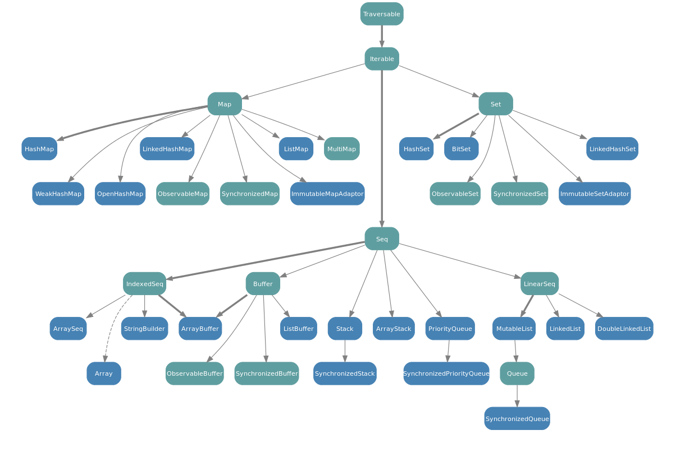

# Les collections en Scala

<!-- .slide: class="page-title" -->


## Les collections - Types de collections

- Les collections en Scala sont composées d'une hiérarchie de classe
- Deux branches existent en parallèle
  - Une branche **mutable**
  - Une branche **immutable**
- Les collections sont typées comme en Java
  - Opérateur de typage : `[]`
  - `List[T]`, `Seq[T]`,...


## Les collections - Hiérarchies immutable

<figure>
     
</figure>


## Les collections - Hiérarchies mutable

<figure style="width:80%">
     
</figure>

Tips : Lorsque l'on utilise une collection issue de la branche mutable, il faut préfixer le nom de la classe par le package mutable.

```scala
mutable.Set()
```


## Les collections - Hiérarchies

- `Traversable`
  - Définition du comportement minimal d’une collection
- `Iterable`
  - Itération sur l’ensemble des éléments de la collection
- `Seq`
  - Ensemble d’éléments ordonnés
- `Set`
  - Ensemble d’éléments sans dupliqua
- `Map`
  - Ensemble d’éléments clef-valeur


## Les collections - Hiérarchies

- L'ensemble des collections se construisent de la même manière :
  - &lt;*Nom de la classe*&gt;([*Enumération des éléments*])
- Exemple

```scala
val numbers = List(1, 2, 3, 4)

val set = Set(1, 1, 2)  //résultat  [1,2]

val kv = Map(1 -> 2, 2-> 5)

val seq = Seq(1, 2, 3)
```


## Les collections - Monade

- Les collections sont des types *monadique*
- Qu'est ce qu'une monade?

> Une monade est comme une boite, vide ou ayant un contenu, qui nous fournit des opérations au dessus de la valeur éventuellement encapsulée.

- Selon la définition, la collection serait la boite, elle contiendrait des éléments
- Sur cette collection, on appliquerait des opérations de :
  - Transformation,
  - Filtrage,
  - Parcours
  - etc


## Les collections - Les opérations

- `Map()`
- `filter()`
- `Flatmap()`
- `foreach()`
- `fold()`
- `zip()`
- `partition()`
- etc


## Les collections - Exemples

- L'opération de `map()` permet de transformer une collection d'un type A en une collection d'un type B.
- le paramètre est une fonction de type

```scala
List[A].map[B](A=>B):List[B]
```

- Exemple :

```scala
case class Eleve(name:String, age:Int)

val e1 = Eleve("michel", 30)
val e2 = Eleve("Louis", 18)
val e3 = Eleve("Patrick",23)

val eleves = List(e1, e2, e3)

val ages = eleves.map(e => e.age) //transformation de la liste d’élèves
println(ages) // List(30,18,23)
```


## Les collections - Exemples

- L'opération de `filter()` permet de filtrer les élément d'une collection
- le paramètre est une fonction de type

```scala
List[A].filter(A=>Boolean):List[A]
```

- Exemple :

```scala
case class Eleve(name:String, age:Int)

val e1 = Eleve("michel", 30)
val e2 = Eleve("Louis", 18)
val e3 = Eleve("Patrick",23)

val eleves = List(e1, e2, e3)

val filteredEleves = eleves.filter { e => e.age > 18 }
println(filteredEleves)  //List(Eleve(michel,30), Eleve(Patrick,23))
```


## Les collections - Exemples

- L'opération de `flatMap()` permet de transformer une collection d'un type A en une collection d'un type B, en retournant le résultat dans le même type monadique initial
- le paramètre est une fonction de type

```scala
List[A].filter(A=>GenTraversableOnce[B]):List[B]
```

- Exemple :

```scala
val li = List(List(1, 2, 3, 5),List(6, 7, 8, 9))
println(li.flatMap(x => x.map(v => v +1))) // List(2, 3, 4, 6, 7, 8, 9, 10)
val la = List(1, 2, 3)
println(la.flatMap(x => List(x+10, x+100))) // List(11, 101, 12, 102, 13, 103)
```


## Les collections - Chaînage des opérations

- Selon les propriétés monadiques, il est possible de chaîner les opérations sur une collection

- Exemple :

```scala
case class Eleve(name:String, age:Int)

val e1 = Eleve("michel", 30)
val e2 = Eleve("Louis", 18)
val e3 = Eleve("Patrick",23)

println(eleves.filter(e => e.age > 18).map(e => e.age)) // List(30, 23)
```


## Les collections - Collection parallèle

- Scala propose certaines implémentations orientées performance permettant de bénéficier de la puissance offerte par les architectures multi cores
- Les collections de ce type sont stockées dans le package `scala.collection.parallel`
- Le nom des collections est préfixé par *Par*
  - `ParSet`, `ParMap`, `ParSeq`, etc.


## TP7 : Manipulation des collections

<!-- .slide: class="page-tp7" -->
