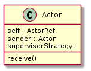
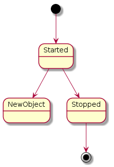

# Introduction à Akka

<!-- .slide: class="page-title" -->


## Acteur : Généralités

- Les acteurs sont un des avatars du Reactive Programming.
- Un ensemble de patterns visant a construire des applications :
  - tolérantes aux pannes,
  - pouvant monter en charge,
  - legeres en terme de ressources,
  - multi threads sans gestion explicite de la concurrence


## Acteur : Les Origines

- Initialement le langage intégrait un module de gestion des acteurs.
- Ce module a grossi et devient un produit a part entière :
  - Support officiel par TypeSafe,
  - Outillage d'administration/supervision,
  - Nombreux algorithmes de load balancing,
  - L'ancien framework intègre au langage est dorénavant déprécié depuis la version 2.10.


## Acteur : Définition

- Un acteur est une unité de calcul encapsulant :
  - Stockage
  - Traitement
  - Communication


## Framework Akka : Les objectifs

- Le framework Akka propose une solution couvrant l'ensemble des besoins pour une application critique :
  - distribution sur plusieurs machines
  - tolérance aux pannes
  - supervision
  - répartition de la charge


## Framework Akka : Désigner ses acteurs

- Pour créer efficacement son modèle d'acteur, il faut adopter la démarche suivante:
  1. Imaginer donner une tâche à un groupe de personne,
  2. Décomposer la tâche de manière à obtenir des tâches avec une responsabilité limitée,
  3. Par rapport à ces tâches identifier les rôles (Acteur) correspondant
  4. Décrire les messages que chaque rôle devra échanger pour accomplir sa tâche

Pour modéliser ce processus, faite un diagramme représentant chaque acteur ainsi que les lignes de communication avec les messages échangés.


## Framework Akka : Implémentation d'un acteur

- Un acteur est une classe très simple, réagissant à des événements. Il convient de suivre quelques règles :
  - Héritage suivant le framework employé
  - Redéfinir les méthodes idoines
  - Tenter de conserver les acteurs stateless
  - Tenter de faire en sorte qu'ils aient une responsabilité (très) limitée.


## Framework Akka : La classe Actor

<figure >
   
</figure>


## Framework Akka : Cycle de vie des Acteurs

- De nombreuses méthodes se trouvent dans l'API permettant un contrôle total sur les transitions entre états des acteurs.
- Méthodes `pre[StateName]` `post[StateName]`.
- Ci-dessous un extrait simplifié du cycle de vie.

<figure >
   
</figure>


## Framework Akka : Cycle de vie des Acteurs

- Diagramme officiel extrait des documentations Akka officielles.

<figure >
   
</figure>


## Framework Akka : Acteurs et communication

- Les acteurs communiquent de manière **asynchrone** :

  - Jamais de blocage du système,
  - Idéal en terme de montée en charge, déployer plus d'acteurs sur plus de machines induit une augmentation du throughput,
  - Plus simple à gérer pour la supervision, les timeouts sont vite assimilés à des défauts applicatifs.


## Framework Akka : Akka & composants

- Akka est un ensemble de composants parmi lesquels :

  - Une API
  - Une console de supervision
  - Un DSL

- La partie client-serveur utilise Netty, le projet JBoss de serveur TCP NIO.


## Framework Akka : Exemple

- Après cette introduction générale, regardons la mise en place d'un acteur avec Akka :

  - définition générale du projet SBT,
  - classe principale (manipulation du framework),
  - Implémentation d'un acteur,
  - Implémentation d'un message,
  - mise en place sur une machine.


## Framework Akka : Configuration SBT

- Configuration de base pour déployer le framework Akka

```scala
val scalaTest = "org.scalatest" % "scalatest_2.10" % "2.0" % "test"
val actors = "com.typesafe.akka" % "akka-actor_2.10" % "2.3.6"

lazy val root = (project in file(".")).
  settings(
    name := "SimpleActorSystem",
    version := "0.1.0",
    scalaVersion := "2.10.5",
    libraryDependencies += scalaTest,
    libraryDependencies += actors,
    resolvers += "Typesafe Reposity" at "https://repo.typesafe.com/releases"
  )
```


## Framework Akka : Un Acteur

- Un simple acteur réagissant au message *hello*.

```scala
import akka.actor.Actor

class HelloWordActor extends Actor {

  def receive = {
    case "hello" => println("hello")
    case _ => println(" Sorry !!")
  }

}
```


## Framework Akka : Mise en place de l'environnement

- Un simple acteur réagissant au message *hello*.

```scala
object Main extends App {
  val system = ActorSystem("HelloSystem")
  // defaultActor constructor
  val helloActor = system.actorOf(
    Props[HelloWordActor], name = "helloactor")
  helloActor ! "hello"
  helloActor ! " buenos dias"
}
```


## Framework Akka : Ce qu'il faut retenir

- Points essentiels mis en évidence par l'exemple :

  - Hériter du trait `Actor`,
  - Redéfinir la méthode `receive`, indiquant la réaction adaptée à chaque type de message,
  - Raccourci pour l'invocation de la méthode `send` via !


## Framework Akka : Configuration

- Utilise TypeSafe Config, le framework de TypeSafe
  - Syntaxe basée sur du JSON
  - Couple clés & valeurs hérarchisées
- Permet une configuration très fine
  - Pooling (`ExecutorService`)
  - Routage
  - Spécification du typage des messages acheminés sur les acteurs
  - Déploiement
  - Supervision


## Framework Akka : Configuration

- Pour des besoins avancés ou pour tester des cas spécifiques :
   - développement sur plusieurs nœuds,
   - diverses instances sur la même machine (développement & recette),
   - pour améliorer la robustesse de votre solution.
- Par défaut, nul besoin de configuration explicite.


## Framework Akka : Exemple

- Simple configuration

```scala
akka{
  loggers=["akka.event.slf4j.Slf4jLogger"]
  loglevel="DEBUG"
  actor{
    provider="akka.cluster.ClusterActorRefProvider"
    default dispatcher{
      throughput=10
    }
  }
  remote{
    netty.tcp.port=4711
  }
}
```


## Framework Akka : Monitoring & supervision

- La console Akka permet de superviser son application et de monitorer le fonctionnement de celle-ci en :
  - Échantillonnant les réactions de l'application dans le cas d'envoi de messages,
  - Stockant les résultats de cet échantillonnage dans une base de données, en offrant une restitution visuelle


## Framework Akka : Monitoring & supervision

- L'échantillonnage fait par la console est réalisé grâce à une instrumentation du bytecode des actors
- Par conséquence, Il faudra activer et configurer explicitement les acteurs concernés par ces mesures et la fréquence de celle-ci.

```scala
atmos{
  trace{
      enabled=true
      event-handlers=["akka.atmos.trace.store.mongo.MongoTraceEventListener"]
      mongo{
        db-name="atmos monitoring"
        db-connection-uri="mongodb://localhost"
      }
  }
}
```


## TP9 : Akka & Actors

<!-- .slide: class="page-tp9" -->
